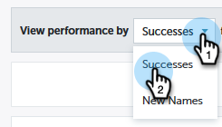

# Dashboard di Performance Insights {#performance-insights-dashboards}

Ulteriori informazioni sulle dashboard disponibili in MPI.

## Coinvolgimento {#engagement}

Il pannello di controllo Coinvolgimento consente di misurare l’efficacia dei programmi di acquisizione dei nomi e delle risorse.

Misurazione del coinvolgimento del pubblico

Scegli la **Successi** per misurare il coinvolgimento del pubblico nei programmi di sviluppo. Il successo è una misura dell&#39;interazione significativa in Marketo.

Lo scopo di un programma è quello di creare un&#39;interazione significativa con la persona o il potenziale cliente. Il successo viene contrassegnato quando una persona raggiunge lo stato che raggiunge tale obiettivo. Può essere partecipare a un webinar, fare clic su un collegamento in un&#39;e-mail o compilare un modulo web. Il successo varia a seconda del canale del programma.

>[!NOTE]
>
>In un programma webinar possono essere presenti più stati, ad esempio: Invitati, registrati e presenti. Invitati o Registrati non sono interazioni significative perché le persone in realtà non guardano il webinar. In questo caso la partecipazione è considerata un successo.

Misurazione dell’acquisizione con un nuovo nome

Scegli la **Nuovi nomi** per misurare l’efficacia dei nuovi programmi di acquisizione dei nomi.

>[!NOTE]
>
>Affinché questo dashboard ti fornisca i migliori risultati, è necessario impostare tutti i programmi per impostare il programma di acquisizione e la data di acquisizione dei lead.

## Pipeline {#pipeline}

Il dashboard della pipeline mostra le prestazioni del canale mediante metriche di primo contatto e multi-touch.

<table> 
 <tbody> 
  <tr> 
   <td>
<strong>Nuove opportunità</strong>
</td> 
   <td>
La parte di credito ricevuta dal programma per influenzare la creazione di nuove opportunità. Può essere una frazione se sono coinvolti più lead.
</td> 
  </tr> 
  <tr> 
   <td>
<strong>Pipeline creata</strong>
</td> 
   <td>
La parte di credito (in valore monetario) ricevuta dal programma per influenzare la creazione di opportunità. Può essere una frazione del totale se sono coinvolti più lead.
</td> 
  </tr> 
  <tr> 
   <td>
<strong>Apri pipeline</strong>
</td> 
   <td>
La parte di credito (in valore monetario) ricevuta dal programma per influenzare la creazione di opportunità ancora aperte. Può essere una frazione del totale se sono coinvolti più lead.
</td> 
  </tr> 
  <tr> 
   <td>
<strong>Entrate previste</strong>
</td> 
   <td>
La parte di credito (in valore monetario) ricevuta dal programma per influenzare la creazione di opportunità. Ricavo previsto è la probabilità di opportunità moltiplicata per il valore di opportunità. Può essere una frazione se sono coinvolti più lead.
</td> 
  </tr> 
  <tr> 
   <td>
<strong>Costo per opportunità creata</strong>
</td> 
   <td>
La parte del costo del programma che ha influenzato nuove opportunità, divisa per il numero totale di nuove opportunità create.
</td> 
  </tr> 
  <tr> 
   <td>
<strong>Rapporto tra pipeline creata e costo</strong>
</td> 
   <td>
La parte di credito ricevuta da un programma per influenzare la creazione di nuove opportunità, divisa per la parte del costo del programma che ha influenzato la creazione di opportunità.
</td> 
  </tr> 
 </tbody> 
</table>

## Entrate {#revenue}

La dashboard Entrate mostra le prestazioni del canale per metriche di primo contatto e multi-touch.

<table> 
 <tbody> 
  <tr> 
   <td>
<strong>Opportunità conquistate</strong>
</td> 
   <td>
La parte di credito ricevuta da un programma per influenzare un'opportunità.
</td> 
  </tr> 
  <tr> 
   <td>
<strong>Entrate vinte</strong>
</td> 
   <td>
La parte di credito (in valore monetario) ricevuta per influenzare una propria opportunità.
</td> 
  </tr> 
  <tr> 
   <td>
<strong>Costo per opportunità</strong>
</td> 
   <td>
La parte del costo del programma che ha influenzato nuove opportunità, divisa per il numero totale di nuove opportunità create.
</td> 
  </tr> 
  <tr> 
   <td>
<strong>Rapporto tra ricavi e costi</strong>
</td> 
   <td>
La parte del credito (in valore monetario) ricevuta per influenzare una propria opportunità divisa per la parte del costo del programma che ha influenzato nuove opportunità.
</td> 
  </tr> 
 </tbody> 
</table>
