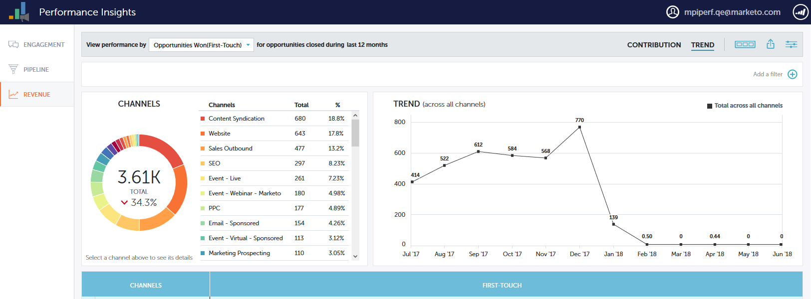

# Panoramica delle tendenze di [!UICONTROL Performance Insights] {#performance-insights-trend-overview}

[!UICONTROL Trend] mostra le prestazioni del canale in un periodo di tempo.

Fare clic sulla scheda **[!UICONTROL Trend]** per accedere a questa visualizzazione.

## [!UICONTROL Trend] {#trend}

Seleziona la metrica in base alla quale visualizzare le prestazioni.

Le metriche sono presentate tramite due grafici: ciambella e linea.

Il grafico ad anello mostra i primi dieci canali per la metrica selezionata.

Il grafico a linee mostra l’andamento delle prestazioni dei canali per la metrica selezionata negli ultimi 12 mesi.

Seleziona uno o più canali e il grafico a linee mostra la tendenza dei canali. Fai di nuovo clic sui canali per deselezionare.

La griglia di dati sottostante funziona come un foglio di calcolo e mostra tutti i dati di tendenza disponibili per la metrica selezionata per gli ultimi 12 mesi.

Espandere un canale per visualizzare i suoi dieci programmi principali, con i programmi rimanenti combinati.

>[!NOTE]
>
>Fai clic sulla casella di controllo accanto a un canale per attivarlo/disattivarlo nel grafico ad anello.
