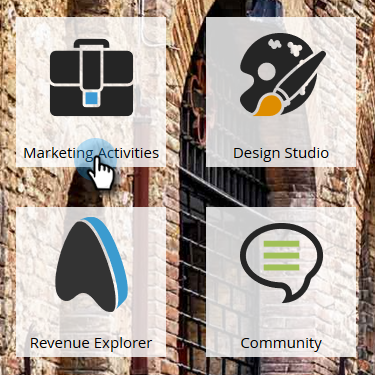
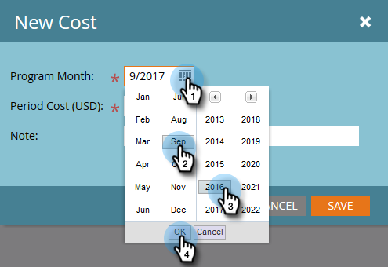
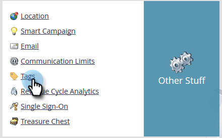
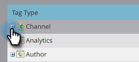
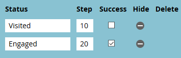

# Configurazione di [!UICONTROL Performance Insights] {#setting-up-performance-insights}

Segui i passaggi seguenti per impostare MPI.

## Configurazione dell’opportunità {#opportunity-setup}

1. Fai clic su **[!UICONTROL Admin]**.

   

1. Fai clic su **[!UICONTROL Revenue Cycle Analytics]**.

   

   >[!NOTE]
   >
   >Se non si dispone di RCA, è necessario selezionare **[!UICONTROL Program Analysis]** per il passaggio 2.

1. In Attribution, fare clic su **[!UICONTROL Edit]**.

   

1. Vengono visualizzate le impostazioni di attribuzione.

   

   Se l’attribuzione è esplicita, assicurati che il ruolo di contatto dell’opportunità sia stato popolato (tramite l’endpoint &quot;Opportunity Role&quot; o tramite l’integrazione CRM).

   Se l’attribuzione è implicita, assicurati che il campo aziendale sul lead/contatto corrisponda al Nome account dell’opportunità.

   >[!NOTE]
   >
   >Assicurati che tutte le opportunità siano compilate nei campi appropriati:
   >
   >* [!UICONTROL Opportunity Amount]
   >* [!UICONTROL Is Closed]
   >* [!UICONTROL Is Won]
   >* [!UICONTROL Creation Date] (potrebbe non essere impostato nel tuo caso)
   >* [!UICONTROL Closed Date] (potrebbe non essere impostato nel tuo caso)
   >* [!UICONTROL Opportunity Type]

## Configurazione del programma {#program-setup}

Aggiornare i costi del programma per almeno 12 mesi. Puoi farlo manualmente o utilizzando l’API del programma. In questo esempio lo facciamo manualmente.

1. Fai clic su **[!UICONTROL Marketing Activities]**.

   

1. Individuare e selezionare il programma.

   

1. Fai clic sulla scheda **[!UICONTROL Setup]**.

   

1. Trascina **[!UICONTROL Period Cost]** nell&#39;area di lavoro.

   

1. Impostare il mese del programma per almeno 12 mesi fa e fare clic su **[!UICONTROL Ok]**.

   

1. Impostare il costo del periodo e fare clic su **[!UICONTROL Save]**.

   

Quindi, rivedi il comportamento di analisi per indicare se un particolare canale deve essere incluso nell’analisi. Imposta il comportamento di Analytics (Normale, Inclusivo, Operativo).

1. Fai clic su **[!UICONTROL Admin]**.

   

1. Fai clic su **[!UICONTROL Tags]**.

   

1. Fare clic su **+** per espandere l&#39;elenco dei canali.

   

1. Fare doppio clic sul canale desiderato.

   

1. Fare clic sul menu a discesa **[!UICONTROL Analytics Behavior]** e selezionare il comportamento desiderato.

   

1. Imposta i criteri di successo.

   

1. Fai clic su **[!UICONTROL Save]**.

   

## Collega il programma alla persona {#tie-the-program-to-the-person}

1. Assicurati che il programma di acquisizione e la data di acquisizione siano stati impostati per ogni persona nel database affinché l’attribuzione del primo contatto funzioni.
1. Assicurati che i tuoi programmi impostino gli stati di successo per le tue persone.

>[!NOTE]
>
>Le modifiche apportate non sono istantanee. È necessario un periodo overnight prima che le modifiche diventino effettive.
