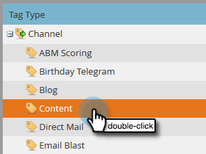
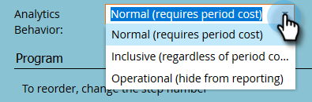

# Impostazione di Performance Insights {#setting-up-performance-insights}

Segui i passaggi seguenti per impostare MPI.

## Configurazione dell’opportunità {#opportunity-setup}

1. Clic **Amministratore**.

   

1. Clic **Analisi del ciclo dei ricavi**.

   

   >[!NOTE]
   >
   >Se non disponi di RCA, dovrai selezionare **Analisi del programma** per il passaggio 2.

1. In Attribution, fai clic su **Modifica**.

   

1. Vengono visualizzate le impostazioni di attribuzione.

   

   Se l’attribuzione è esplicita, assicurati che il ruolo di contatto dell’opportunità sia stato popolato (tramite l’endpoint &quot;Opportunity Role&quot; o tramite l’integrazione CRM).

   Se l’attribuzione è implicita, assicurati che il campo aziendale sul lead/contatto corrisponda al Nome account dell’opportunità.

   >[!NOTE]
   >
   >Assicurati che tutte le opportunità siano compilate nei campi appropriati:
   >
   >* Importo dell’opportunità
   >* È chiuso
   >* E&#39; Vinto
   >* Data di creazione (potrebbe non essere impostata nel tuo caso)
   >* Data di chiusura (non impostata nel tuo caso)
   >* Tipo di opportunità

## Configurazione del programma {#program-setup}

Aggiornare i costi del programma per almeno 12 mesi. Puoi farlo manualmente o utilizzando l’API del programma. In questo esempio lo facciamo manualmente.

1. Clic **Attività di marketing**.

   

1. Individuare e selezionare il programma.

   

1. Fai clic su **Configurazione** scheda.

   

1. Trascina **Costo periodo** nell’area di lavoro.

   

1. Imposta il mese del programma per almeno 12 mesi fa e fai clic su **Ok**.

   

1. Imposta il costo del periodo e fai clic su **Salva**.

   

Quindi, rivedi il comportamento di analisi per indicare se un particolare canale deve essere incluso nell’analisi. Imposta il comportamento di Analytics (Normale, Inclusivo, Operativo).

1. Clic **Amministratore**.

   

1. Clic **Tag**.

   

1. Fai clic su **+** per espandere l&#39;elenco Canali.

   

1. Fare doppio clic sul canale desiderato.

   

1. Fai clic su **Comportamento di Analytics** e selezionare il comportamento desiderato.

   

1. Imposta i criteri di successo.

   

1. Clic **Salva**.

   

## Collega il programma alla persona {#tie-the-program-to-the-person}

1. Assicurati che il programma di acquisizione e la data di acquisizione siano stati impostati per ogni persona nel database affinché l’attribuzione del primo contatto funzioni.
1. Assicurati che i tuoi programmi impostino gli stati di successo per le tue persone.

>[!NOTE]
>
>Le modifiche apportate non sono istantanee. È necessario un periodo overnight prima che le modifiche diventino effettive.
