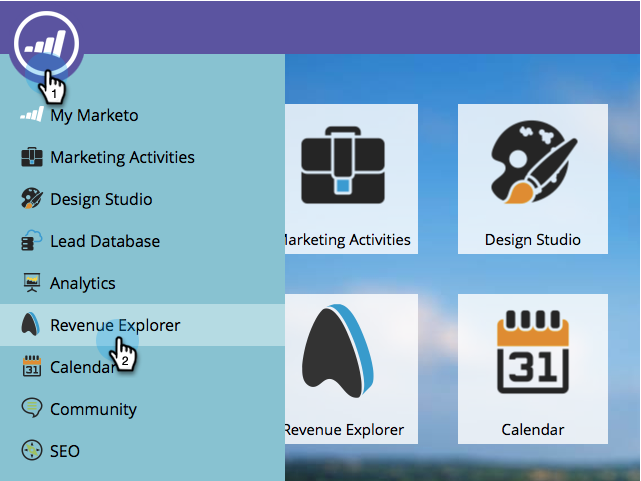

# Creare un rapporto di analisi e-mail in cui sono elencati i lead {#build-an-email-analysis-report-that-lists-leads}

>[!AVAILABILITY]
>
>Non tutti i clienti hanno acquistato questa funzionalità. Contatta il tuo Customer Success Manager per maggiori dettagli.

Segui questi passaggi per creare un rapporto di analisi e-mail che ti mostrerà ogni lead a cui è stato inviato un messaggio e-mail specifico. Questo rapporto includerà anche gli stati Clic e Apri .

>[!NOTE]
>
>Il motore dati che supporta Email Analysis RCA ignora più di 12 clic per persona se proviene dalla stessa e-mail e dalla stessa campagna. Tieni presente questo aspetto quando confronti i rapporti di analisi e-mail con i rapporti standard di Marketo Analytics.

1. Launch **Esplora ricavi**.

   

1. Fai clic su **Crea nuovo** then **Rapporto**.

   

1. Seleziona Analisi e-mail e fai clic su **OK**.

   

1. Trova il punto giallo Nome e-mail, fai clic con il pulsante destro del mouse e seleziona **Filtro**.

   

1. Fai doppio clic sull’e-mail desiderata dall’elenco e fai clic su **OK**.

   

1. Trascina **Nome e-mail** punto giallo su **Colonne**.

   

   >[!TIP]
   >
   >Ci sono molti attributi lead/società che è possibile aggiungere come colonne, estrarre!

1. Trova il **Nome completo** punto giallo e trascinalo su **Righe**.

   

1. Aggiungi ora il **Misure** ti interessa cliccarli due volte.

   

>[!NOTE]
>
>A seconda della quantità di dati che si dispone di questo rapporto, l’aggiornamento potrebbe richiedere un po’ di tempo.

Missione completa!
