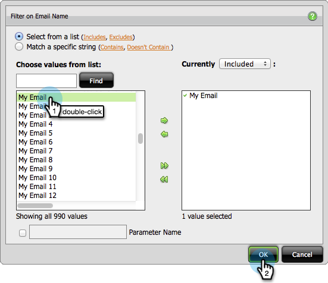

# Creare un report di analisi e-mail in cui siano elencati i lead {#build-an-email-analysis-report-that-lists-leads}

>[!AVAILABILITY]
>
>Non tutti i clienti hanno acquistato questa funzionalità. Per informazioni, contattate il rappresentante commerciale.

Seguite questi passaggi per creare un rapporto Analisi e-mail che mostrerà tutti i lead a cui è stato inviato un messaggio e-mail specifico. Questo rapporto includerà anche gli stati Click e Open. 1. Avvia Esplora entrate.

1. Fare clic su **Nuovo report**.

   

1. Selezionate l&#39;area Analisi e-mail e fate clic su **OK**.

   

1. Trovare il punto giallo Nome e-mail, fare clic con il pulsante destro del mouse su di esso e selezionare **Filtro**.

   

1. Fare doppio clic sull&#39;e-mail desiderata dall&#39;elenco e fare clic su **OK**.

   

1. Trascinate il punto giallo Nome e-mail sulle colonne.

   

   >[!TIP]
   >
   >Ci sono molti attributi lead/società che puoi aggiungere come colonne, check out!

1. Individuare il punto giallo Nome completo e trascinarlo sulle righe.

   

1. Per aggiungere le misure desiderate, fai doppio clic su di esse.

   

>[!NOTE]
>
>A seconda della quantità di dati di cui disponete per questo rapporto, l&#39;aggiornamento potrebbe richiedere un po&#39; di tempo.

Ora che hai finito il tuo rapporto dovrebbe assomigliare a questo:

Missione completa!
