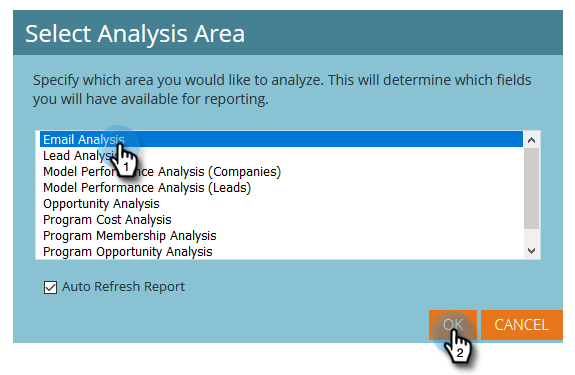

# Creare un rapporto di analisi e-mail con l’elenco dei lead {#build-an-email-analysis-report-that-lists-leads}

Segui questi passaggi per creare un rapporto di analisi e-mail che ti mostrerà ogni lead a cui è stata inviata un’e-mail specifica. Questo rapporto includerà anche le statistiche di clic e apertura.

>[!AVAILABILITY]
>
>Non tutti hanno acquistato questa funzione. Per ulteriori informazioni, contatta il team dell’account di Adobe (il tuo Account Manager).

>[!NOTE]
>
>Il motore di dati che supporta E-mail Analysis RCA ignora più di 12 clic a persona se provengono dalla stessa e-mail e campagna. Tieni presente questo aspetto durante il confronto tra i rapporti di Email Analysis e quelli standard di Marketo Analytics.

1. Avvia **[!UICONTROL Revenue Explorer]**.

   

1. Fare clic su **[!UICONTROL Create New]** e quindi su **[!UICONTROL Report]**.

   

1. Seleziona **[!UICONTROL Email Analysis]** e fai clic su **[!UICONTROL OK]**.

   

1. Trovare il punto giallo **[!UICONTROL Email Name]**, fare clic con il pulsante destro del mouse su di esso e selezionare **[!UICONTROL Filter...]**.

   

1. Fare doppio clic sull&#39;e-mail scelta nell&#39;elenco e fare clic su **[!UICONTROL OK]**.

   

1. Trascinare il punto giallo **[!UICONTROL Email Name]** su **[!UICONTROL Columns]**.

   

   >[!TIP]
   >
   >È possibile aggiungere come colonne molti attributi lead/società ed estrarli.

1. Trovare il punto giallo **[!UICONTROL Full Name]** e trascinarlo su **[!UICONTROL Rows]**.

   

1. Aggiungere ora **[!UICONTROL Measures]** a cui si è interessati facendo doppio clic su di essi.

   

>[!NOTE]
>
>A seconda della quantità di dati disponibili, l&#39;aggiornamento del report potrebbe richiedere del tempo.

Missione completata!
