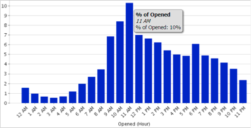

# Informazioni sull’area di analisi e-mail {#understanding-the-email-analysis-area}

L’area Analisi e-mail si concentra sulle metriche e-mail. Questo articolo introduce tutti i rapporti disponibili al suo interno.

>[!AVAILABILITY]
>
>Questa funzione è disponibile per gli utenti che dispongono della funzione Seleziona edizione o [Analisi del ciclo dei ricavi](https://www.marketo.com/global-enterprise/marketo-revenue-cycle-analytics/) add-on. Contatta il tuo rappresentante commerciale per i dettagli.

## Fai clic su Griglia di calore attività e-mail {#email-click-activity-heat-grid}

Questo rapporto mostra il giorno della settimana e l’ora del giorno in cui i lead fanno clic sulle e-mail. Più verde è la casella, più clic in quel giorno e nell&#39;ora specifici. Il filtro corrente include tutte le e-mail inviate negli ultimi 7 giorni. Il tempo è in CST.

## Distribuzione ora clic su e-mail {#email-clicked-time-distribution}

Questo rapporto mostra la percentuale di clic totali sulle e-mail per ogni ora del giorno. Il filtro corrente include tutte le e-mail inviate negli ultimi 7 giorni. Il tempo è in CST.

## Decadimento frequenza clic e-mail {#email-click-rate-decay}

Questo rapporto mostra la percentuale di clic totali sulle e-mail nello stesso giorno in cui viene inviata un’e-mail e nei giorni successivi. Il filtro corrente include tutte le e-mail inviate 7 giorni fa.

## E-mail Apri griglia di calore attività {#email-open-activity-heat-grid}

Questo rapporto mostra il giorno della settimana e l’ora del giorno in cui i lead aprono e-mail. Più verde è la scatola più si apre in quel giorno e in quell&#39;ora specifici. Il filtro corrente include tutte le e-mail inviate negli ultimi 7 giorni. Il tempo è in CST.

## Decadimento a tasso aperto {#open-rate-decay}

Questo rapporto mostra la percentuale di aperture totali delle e-mail nello stesso giorno in cui viene inviata un’e-mail e nei giorni successivi. Il filtro corrente include tutte le e-mail inviate 7 giorni fa.

## Distribuzione a tempo aperto {#open-time-distribution}

Questo rapporto mostra la percentuale di aperture totali delle e-mail per ogni ora del giorno. Il filtro corrente include tutte le e-mail inviate negli ultimi 7 giorni. Il tempo è in CST.

## Griglia di calore inviata all&#39;attività {#sent-activity-heat-grid}

Questo rapporto mostra il giorno della settimana e l’ora del giorno in cui invii le e-mail. Più verde è la casella, più e-mail vengono inviate in quel giorno e nell’ora specifici. Il filtro corrente include tutte le e-mail inviate negli ultimi 7 giorni. Il tempo è in CST.

