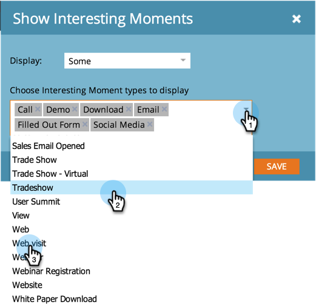

# Configurare un analizzatore di influenza opportunità {#configure-an-opportunity-influence-analyzer}

Una volta [creare un analizzatore di influenza opportunità](/help/marketo/product-docs/reporting/revenue-cycle-analytics/opportunity-influence-analyzer/create-an-opportunity-influence-analyzer.md), puoi configurare i tipi di [momenti interessanti](/help/marketo/product-docs/marketo-sales-insight/msi-for-salesforce/features/tabs-in-the-msi-panel/interesting-moments/interesting-moments-overview.md) inclusi.

>[!PREREQUISITES]
>
>[Creare un analizzatore di influenza opportunità](/help/marketo/product-docs/reporting/revenue-cycle-analytics/opportunity-influence-analyzer/create-an-opportunity-influence-analyzer.md)

1. Fai clic su **Analytics**.

   

1. Vai su Analytics e seleziona il tuo Opportunity Influence Analyzer.

   

   Se ci sono troppi momenti interessanti nel grafico dell&#39;analizzatore, puoi ridurli deselezionando le persone nel **Impostazioni** o riducendo i tipi di momenti interessanti.

1. Per configurare i tipi di momenti interessanti da includere, passa alla scheda Configurazione e trascina il filtro Momenti interessanti .

   

1. Scegliere se visualizzare Tutti, Nessuno o Alcuni.

   

1. Se scegli Alcuni, puoi scegliere quali tipi includere.

   

1. Fai clic su ogni tipo di momento interessante che desideri. Quindi fai clic su **Salva**.

1. Fai clic sulla scheda principale per visualizzare la cronologia dell’opportunità con solo i tipi selezionati di momento interessante.

   

>[!MORELIKETHIS]
>
>[Comunicare la storia di marketing con Opportunity Influence Analyzer](/help/marketo/product-docs/reporting/revenue-cycle-analytics/opportunity-influence-analyzer/tell-the-marketing-story-with-an-opportunity-influence-analyzer.md)
