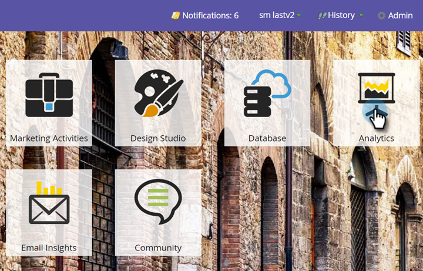

# Configurare un analizzatore di influenza opportunità {#configure-an-opportunity-influence-analyzer}

Una volta che [create un analizzatore di influenza opportunità](create-an-opportunity-influence-analyzer.md), potete configurare i tipi di [momenti interessanti](/help/marketo/product-docs/marketo-sales-insight/msi-for-salesforce/features/tabs-in-the-msi-panel/interesting-moments/interesting-moments-overview.md) inclusi.

>[!PREREQUISITES]
>
>* [Creare un analizzatore di influenza opportunità](create-an-opportunity-influence-analyzer.md)

1. Fate clic su Analytics.

   

1. Andate ad Analytics e selezionate il vostro analizzatore di influenza opportunità.

   

   Se il grafico dell&#39;analizzatore contiene troppi momenti interessanti, puoi ridurli deselezionando le persone nel pannello **Impostazioni** o riducendo i tipi di momenti interessanti.

1. Per configurare quali tipi di momenti interessanti includere, andate alla scheda Configurazione e trascinate il filtro Momenti interessanti.

   

1. Scegliete se visualizzare Tutti, Nessuno o Alcuni.

   

1. Se scegliete Alcuni, potete scegliere quali tipi includere.

   

1. Fai clic su ogni tipo di momento interessante che vuoi. Fate clic su Salva.
1. Fai clic sulla scheda principale per vedere la cronologia dell&#39;opportunità con solo i tipi selezionati di momento interessante.

   

>[!NOTE]
>
>Per gli altri analizzatori, vedere [Reporting di base](https://docs.marketo.com/display/docs/basic+reporting).

>[!MORELIKETHIS]
>
>* [Comunicare la storia di marketing con un analizzatore di influenza opportunità](tell-the-marketing-story-with-an-opportunity-influence-analyzer.md)

