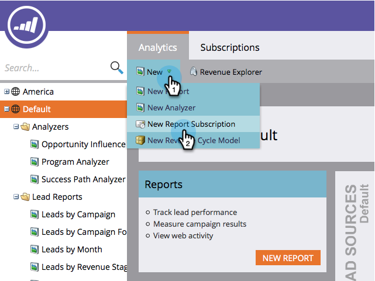
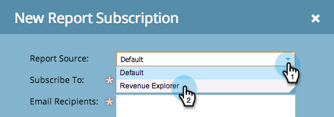

# Esportare dati analizzatore influenza opportunità {#export-opportunity-influence-analyzer-data}

Per ricevere aggiornamenti dai rapporti di Revenue Cycle Explorer e condividerli, è possibile sottoscrivere qualsiasi indirizzo e-mail a un rapporto esistente.

1. Vai a **[!UICONTROL Analytics]** e seleziona **[!UICONTROL New]** > **[!UICONTROL New Report Subscription]**.

   

   >[!NOTE]
   >
   >Per sottoscrivere un report di base creato in un programma, vedere [Sottoscrivere un report di base](/help/marketo/product-docs/reporting/basic-reporting/report-subscriptions/subscribe-to-a-basic-report.md).

1. Per **[!UICONTROL Report Source]**, seleziona **[!UICONTROL Revenue Explorer]**.

   

1. Naviga nella struttura ad albero delle cartelle e seleziona il rapporto.

   

1. Inserisci gli indirizzi e-mail e imposta la frequenza delle e-mail del rapporto.

   

   >[!NOTE]
   >
   >Chiunque può annullare l’abbonamento al report nell’e-mail che riceve.

1. Il tuo abbonamento è impostato. Se hai incluso il tuo indirizzo e-mail, riceverai il rapporto tramite e-mail.

   

>[!MORELIKETHIS]
>
>Scopri come [gestire tutte le sottoscrizioni ai report](/help/marketo/product-docs/reporting/basic-reporting/report-subscriptions/manage-report-subscriptions.md) in un&#39;unica posizione.
