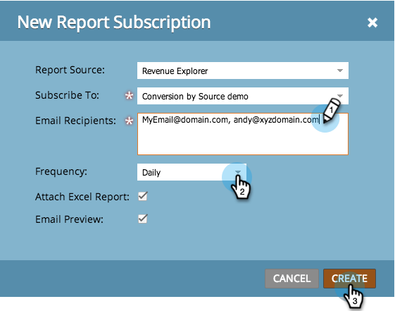

# Esporta dati analizzatore di influenza opportunità {#export-opportunity-influence-analyzer-data}

Per ricevere gli aggiornamenti dai rapporti di Esplora [ciclo](http://docs.marketo.com/display/docs/revenue+cycle+analytics) ricavi e condividerli, puoi sottoscrivere qualsiasi indirizzo e-mail a un rapporto esistente.

1. Vai ad **Analytics** e seleziona **Nuovo** **>** Nuovo **** report **** **** Iscrizione.

   

   >[!NOTE]
   >
   >Per sottoscrivere un rapporto di base creato in un programma, vedere [Sottoscrivere un rapporto](../../../../product-docs/reporting/basic-reporting/report-subscriptions/subscribe-to-a-basic-report.md) di base.

1. Per Origine rapporto, selezionare Esplora **ricavi.**

   

1. Spostatevi nella struttura delle cartelle e selezionate il rapporto.

   

1. Inserite gli indirizzi e-mail e impostate la frequenza delle e-mail del rapporto.

   

   >[!NOTE]
   >
   >Chiunque può annullare l’iscrizione nel messaggio e-mail ricevuto.

1. L&#39;abbonamento è impostato! Se avete incluso il vostro indirizzo e-mail, riceverete il rapporto tramite e-mail.

   

>[!NOTE]
>
>**Articoli correlati**
>
>Scopri come [gestire tutte le iscrizioni](../../../../product-docs/reporting/basic-reporting/report-subscriptions/manage-report-subscriptions.md) ai rapporti in un&#39;unica posizione.

>[!NOTE]
>
>**Tubo profondo**
>
>Ulteriori informazioni sulle analisi avanzate di Marketo sono disponibili nella sezione approfondita di [Revenue Cycle Explorer](http://docs.marketo.com/display/docs/revenue+cycle+analytics) .

