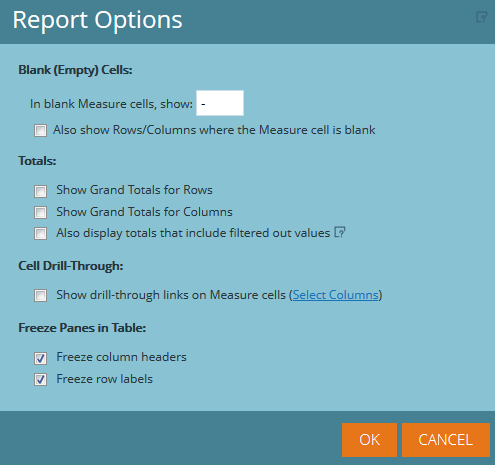

# Panoramica della generazione di rapporti sui programmi avanzati {#advanced-program-reporting-overview}

**Esplora ricavi** include diverse aree di analisi e un’ampia gamma di nuove metriche che consentono di misurare l’efficacia del programma.

Ci sono molte buone qui dentro. Controlliamole!

## Cos’è un’area di analisi? {#whats-an-analysis-area}

Le aree di analisi contengono set di dati e metriche diversi in Esplora ricavi. Ogni area si riferisce all’oggetto di reporting che hai scelto di visualizzare.

## Aree di analisi del programma {#program-analysis-areas}

* **[Analisi dei costi del programma](understanding-the-program-cost-analysis-area.md)** - Visualizzare il ROI di tutti i programmi.

* **[Analisi dell&#39;appartenenza al programma](understanding-the-program-membership-analysis-area.md)** - Visualizza i risultati per canale, partecipazione, criteri di successo, ecc.

* **[Analisi delle opportunità del programma](understanding-the-program-opportunity-analysis-area.md)** - Opportunità generate in base alla distribuzione, ai ricavi e al ROI.

* **[Analisi della fase di ricavo del programma](understanding-the-program-revenue-stage-analysis-area.md)** - Nuovi nomi che hanno raggiunto particolari fasi di successo all&#39;interno del modello del ciclo dei ricavi.

## Analisi dei programmi {#program-analyzers}

* **Analisi del programma** - Identificare rapidamente i programmi che hanno successo o meno e concentrare le risorse in modo appropriato.

* **Analisi dell’influenza delle opportunità** - Dimostrare il contributo di Marketing misurando l&#39;impatto dei programmi e degli impegni chiave che hanno generato opportunità.

## Opzioni rapporto {#report-options}

In ciascun rapporto sono disponibili diverse opzioni per personalizzare l’esperienza.

>[!CAUTION]
>
>Anche se hai l’opzione di mostrare Righe/Colonne in cui la cella Misura viene lasciata vuota (prima casella di controllo), sconsigliamo di eseguire questa operazione, in quanto potrebbe rallentare l’elaborazione e potrebbe addirittura causare il timeout del rapporto.

>[!NOTE]
>
>I dati in Revenue Cycle Explorer si aggiornano di notte dalla tua istanza di Marketo. Di conseguenza, qualsiasi modifica nell&#39;attività personale e dell&#39;account all&#39;interno di Marketo verrà riflessa nel giorno lavorativo successivo in Revenue Cycle Explorer.

Acquisire familiarità con l’analisi dei ricavi ti fornirà informazioni approfondite sui tuoi programmi e sul loro impatto.
