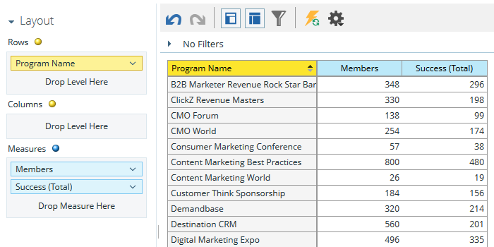

# Creare un rapporto di analisi per l&#39;appartenenza al programma che elenca i lead {#build-a-program-membership-analysis-report-that-lists-leads}

Per creare un rapporto di analisi per l&#39;iscrizione al programma che mostri tutti i nomi dei membri del programma, effettuate le seguenti operazioni.

>[!AVAILABILITY]
>
>Non tutti i clienti hanno acquistato questa funzionalità. Per informazioni, contattate il rappresentante commerciale.

1. Avvia Esplora entrate.

   

1. Fare clic su **Crea nuovo**, quindi su **Report**.

   

1. Selezionare **Program Membership Analysis** e fare clic su **OK**.

   

1. Trova e fai doppio clic sul punto giallo Nome programma.

   

1. Trova e fai doppio clic sul punto blu Membri.

   

1. Trova e fai doppio clic sul punto blu Success (Totale).

   

Vedete quanto era facile?

Potete aggiungere rapidamente un attributo lead, ad esempio _Nome completo_, per vedere chi sono i membri.

>[!TIP]
>
>Ci sono molti attributi lead/società da cui scegliere. Controllali!

1. Trova e fai doppio clic sul punto giallo **Nome completo**.

   

Ce l&#39;avete!

