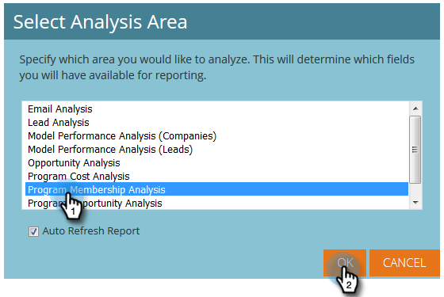
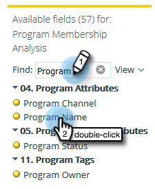
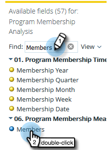
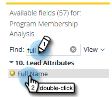

# Creare rapporto di analisi dell’iscrizione al programma che elenca i lead {#build-a-program-membership-analysis-report-that-lists-leads}

Per creare un report di analisi dell&#39;appartenenza al programma che mostri tutti i nomi dei membri del programma, eseguire la procedura seguente.

>[!AVAILABILITY]
>
>Non tutti gli utenti di Marketo Engage hanno acquistato questa funzionalità. Per informazioni, contatta il team dell’account di Adobe (il tuo Account Manager).

1. Avvia **[!UICONTROL Revenue Explorer]**.

   

1. Fare clic su **[!UICONTROL Create New]** e quindi su **[!UICONTROL Report]**.

   

1. Seleziona **[!UICONTROL Program Membership Analysis]** e fai clic su **[!UICONTROL OK]**.

   

1. Individuare e fare doppio clic sul punto giallo **[!UICONTROL Program Name]**.

   

1. Individuare e fare doppio clic sul punto blu **[!UICONTROL Members]**.

   

1. Individuare e fare doppio clic sul punto blu **[!UICONTROL Success (Total)]**.

   

Vedi quanto è stato facile?

È possibile aggiungere rapidamente un attributo del lead come _[!UICONTROL Full Name]_per visualizzare i membri.

>[!TIP]
>
>Sono disponibili numerosi attributi lead/società tra cui scegliere. Controllateli!

1. Individuare e fare doppio clic sul punto giallo **[!UICONTROL Full Name]**.

   

Eccolo!

