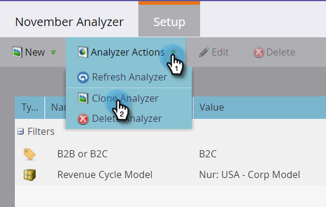

# Clonare un programma Analyzer {#clone-a-program-analyzer}

Dopo aver salvato un analizzatore, è facile clonarlo per crearne uno nuovo. Quindi, entra e modifica il nuovo se ha bisogno di modifiche.

1. Fai clic sul pulsante **Analytics** piastrelle.

   

1. Fai clic sul pulsante **Analisi del programma** piastrelle.

   

1. Quando l’analizzatore salvato è aperto, apri il menu a discesa Azioni di Analyzer e seleziona **Analisi clone**.

   

1. Seleziona la posizione dell’analizzatore clonato dal **Clona in** e **Cartella** a discesa.

   

1. Denomina l&#39;analizzatore clonato e fai clic su **Clona**.

   

1. Ora, avete due analizzatori identici con nomi diversi. Apri il clone per apportare le modifiche necessarie.

   

   >[!MORELIKETHIS]
   >
   >[Creare un’analisi dei programmi](/help/marketo/product-docs/reporting/revenue-cycle-analytics/program-analytics/create-a-program-analyzer.md)
