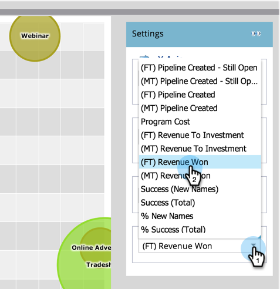

# Confronta l&#39;efficacia del canale con l&#39;analizzatore del programma {#compare-channel-effectiveness-with-the-program-analyzer}

Utilizzare Program Analyzer per confrontare i costi di canale, l&#39;acquisizione di membri, la pipeline, le entrate e altro ancora, per identificare i canali più efficaci e meno efficaci.

>[!PREREQUISITES]
>
>* [Creare un analizzatore di programmi](create-a-program-analyzer.md)

1. Fare clic su **Analytics** in **My Marketo.**

   

1. Selezionare il programma **Analizzatore programmi.**

   

1. Cambia la vista in **By** **Canale**.

   

1. Utilizzate il menu a discesa **Asse X** per scegliere una metrica per l&#39;asse orizzontale. Cominciamo con **Costo programma**.

   

1. Utilizzate il menu a discesa Asse Y per scegliere una metrica per l&#39;asse verticale. A questo punto, verrà creata la tubazione **(FT) Create**.

   

   >[!NOTE]
   >
   >Molte delle metriche che è possibile scegliere nell&#39;analizzatore di programma sono disponibili con calcoli &quot;first-touch&quot; (FT) e &quot;multi-touch&quot; (MT). È importante comprendere la differenza [tra l&#39;attribuzione FT e MT](/help/marketo/product-docs/reporting/revenue-cycle-analytics/revenue-tools/attribution/understanding-attribution.md).

1. Utilizzate il menu a discesa **Y Axis** (Asse Y) per scegliere la tubazione **(MT) creata**.

   

   In questa vista di attribuzione multi-touch, vediamo che il canale Webinar ha maggiore influenza sulla pipeline creata e costa meno dei canali di presentazione e pubblicità online.

   Ora aggiungiamo altre due dimensioni!

1. Utilizzate il menu a discesa **Dimensione bolla** per selezionare una misura aggiuntiva, come **Nuovi nomi**.

   

1. Guardate come cambia il grafico.

   

   Il canale del webinar si restringe, come misurato da **New Names**. Possiamo concludere che, pur avendo molti membri, è meno efficace nel generare nuovi lead rispetto al canale Tradeshow.

1. Infine, utilizzate il menu a discesa Colore per aggiungere la quarta dimensione. Selezionare **(FT) Revenue** **Won**.

   

1. Guardate come cambiano i colori nel grafico.

   

   Dai colori, impariamo che il canale Tradeshow, la bolla più verde, ha influenzato le maggiori entrate, misurate dall&#39;attribuzione del primo tocco.

1. Ora, se cambiamo la metrica Colore in **(MT) Revenue Won**, vediamo che il canale pubblicitario online, ora il più verde, ha influenzato più ricavi -nel tempo_ che i canali webinar e Tradeshow.

   

Nel nostro esempio, vediamo che il canale di presentazione è sia il più costoso (più lontano a destra) che il più successo (più alto sull&#39;asse Y) quando si misura la tubazione creata dal primo tocco. Consideriamo ora la pipeline di ogni canale creata come misurata dall&#39;attribuzione multi-touch.

>[!TIP]
>
>Gli esempi in questi passaggi misurano l&#39;efficacia in base alla pipeline creata. Utilizzate il menu a discesa Asse Y per selezionare altri modi per misurare l&#39;efficacia dei canali, come Nuovi nomi, Membri, Costo per successo e così via.

>[!MORELIKETHIS]
>
>* [Esplora i dettagli di programma e canale con il programma Analyzer](explore-program-and-channel-details-with-the-program-analyzer.md)
>* [Confronta l&#39;efficacia del programma con Program Analyzer](compare-program-effectiveness-with-the-program-analyzer.md)

>

>[!NOTE]
>
>Ulteriori informazioni sulle analisi avanzate in [Esplora ciclo di entrate](https://docs.marketo.com/display/docs/revenue+cycle+analytics).
