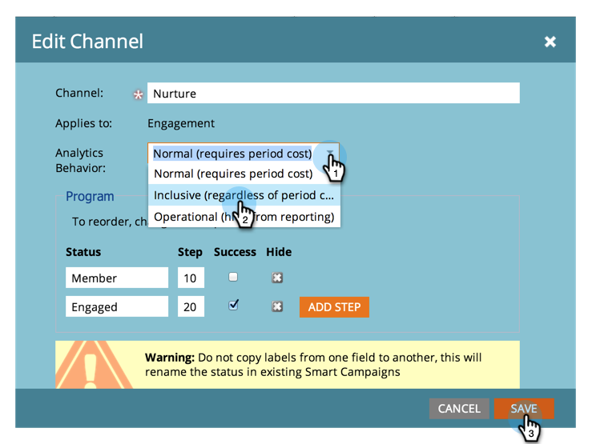

# Rendere disponibile un programma senza costo periodo in esploratore ricavi e analizzatori {#make-a-program-without-a-period-cost-available-in-revenue-explorer-and-analyzers}

I costi del periodo del programma consentono di definire &quot;Quanto denaro&quot; e &quot;Quando&quot; per un programma. Questo viene visualizzato in Revenue Cycle Explorer e in [analizzatori](/help/marketo/product-docs/reporting/revenue-cycle-analytics/opportunity-influence-analyzer/tell-the-marketing-story-with-an-opportunity-influence-analyzer.md).

>[!NOTE]
>
>**Autorizzazioni amministratore richieste**

Alcuni programmi possono dover essere inclusi anche se non hanno un costo di periodo. Anche se è possibile immettere 0 per il costo del periodo, è stato semplificato l&#39;inserimento di questi programmi.

>[!NOTE]
>
>L’analizzatore di programmi classifica il successo del programma in base al costo del periodo. Se non è disponibile alcun costo di periodo, il completamento del programma non verrà visualizzato, indipendentemente dal comportamento di analisi del programma. Se il comportamento di analisi è configurato, i dati verranno visualizzati per le metriche delle opportunità (opportunità pipeline, ricavi ottenuti, ecc.).

1. Nella sezione [!UICONTROL Admin] fare clic su **[!UICONTROL Tags]**.

   

1. Espandi i tuoi canali e fai doppio clic sul canale desiderato.

   >[!NOTE]
   >
   >Tutti i programmi che utilizzano questo canale, indipendentemente dal costo del periodo, saranno disponibili per gli analizzatori e gli esploratori di ricavi. Questa modifica entrerà in vigore il giorno successivo.

   

1. Cambia [!UICONTROL Analytics Behavior] in **Inclusive** e fai clic su **[!UICONTROL Save]**.

   

>[!TIP]
>
>Avete notato l&#39;opzione Operational? Questo fa l&#39;opposto. Sono esclusi questi programmi indipendentemente dal costo del periodo.

Bel lavoro! Ora qualsiasi programma che utilizza il canale modificato verrà incluso in Esplora ricavi e analizzatori senza la necessità di un costo di periodo.

>[!MORELIKETHIS]
>
>[Ignora comportamento di Analytics a livello di programma](/help/marketo/product-docs/reporting/revenue-cycle-analytics/program-analytics/override-analytics-behavior-at-the-program-level.md)
