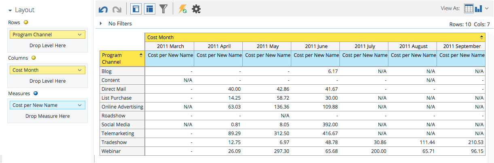

# Informazioni sull’area di analisi dei costi del programma {#understanding-the-program-cost-analysis-area}

L’area Analisi dei costi del programma consente di analizzare l’efficacia dei singoli programmi o di visualizzare i risultati riepilogati per canale per un determinato periodo di tempo.

## Domande aziendali di esempio {#example-business-questions}

Quanti nuovi nomi sono stati generati ogni canale al mese?

Qual è stato il costo per ogni nuovo nome per canale al mese?

Quale percentuale dei nuovi nomi generati ha raggiunto il successo in un programma?

Quanto ho speso per programma al mese?

## Dimension e misure di analisi dei costi del programma {#program-cost-analysis-dimensions-and-measures}

>[!NOTE]
>
>I punti gialli sono dimensioni e i punti blu sono misure.

## Investimento {#investment}

| Misura | Descrizione |
|---|---|
| Costo per membro | Costo medio per membro del programma |
| Costo per nuovo nome | Costo medio per lead acquisito dal programma |
| Costo per successo | Costo medio per lead che ha raggiunto il successo nella progressione di un programma |
| Costo per successo (nuovi nomi) | Costo medio per lead acquisito dal programma E raggiunto il successo nella progressione del programma |
| Costo del programma | Costo totale del programma |

## iscrizione {#membership}

<table> 
 <tbody> 
  <tr> 
   <th>Misura</th> 
   <th>Descrizione</th> 
  </tr> 
  <tr> 
   <td>% nuovi nomi</td> 
   <td>Percentuale di lead acquisiti da un programma</td> 
  </tr> 
  <tr> 
   <td>Membri</td> 
   <td>Numero totale di lead in un programma</td> 
  </tr> 
  <tr> 
   <td>Nuovi nomi</td> 
   <td>Totale delle nuove denominazioni acquisite da un programma</td> 
  </tr> 
 </tbody> 
</table>

## Attributi del programma {#program-attributes}

| Dimensione | Descrizione |
|---|---|
| Canale del programma | Canale del programma |
| Nome del programma | Nome del programma |

## Calendario dei costi del programma {#program-cost-timeframe}

| Dimensione | Descrizione |
|---|---|
| Anno | Calendario dei costi del programma |
| Trimestre | Intervallo di tempo del programma |
| Mese | Calendario dei costi del programma |

## Tag del programma {#program-tags}

| Misura | Descrizione |
|---|---|
| Settore | Tag del programma |
| Linea di prodotto | Tag del programma |
| Proprietario programma | Tag del programma |
| Area geografica | Tag del programma |

## Operazione riuscita {#success}

| Misura | Descrizione |
|---|---|
| % riuscito (nuovi nomi) | Percentuale di lead acquisiti dal programma e realizzati con successo nella progressione del programma |
| % successo (totale) | Percentuale di lead che hanno raggiunto il successo nella progressione di un programma |
| Operazione riuscita (nuovi nomi) | Numero totale di nuovi nomi che hanno raggiunto il successo nella progressione di un programma |
| Successo (totale) | Numero totale di lead che hanno raggiunto il successo nella progressione di un programma |
