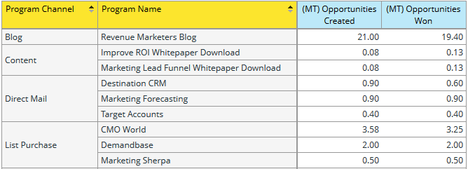

# Informazioni sull’area di analisi delle opportunità del programma {#understanding-the-program-opportunity-analysis-area}

## Panoramica {#overview}

L’area Analisi delle opportunità del programma consente di analizzare l’efficacia dei singoli programmi o di visualizzare i risultati riepilogati per canale del programma.

**Le domande aziendali di esempio a cui puoi rispondere utilizzando questa area di analisi includono:**:

Quante opportunità sono state associate a un determinato programma e quante di queste abbiamo vinto?

Quanti ricavi ha generato un determinato programma o canale?

Quali sono i ricavi da investimento per un determinato programma o canale?

Quali opportunità ha influenzato un determinato programma?

## Misure di attribuzione dell’analisi delle opportunità del programma (punti blu) {#program-opportunity-analysis-attribution-measures-blue-dots}

Le misure disponibili per l’analisi sono generalmente numeri e sono rappresentate da punti blu. I Dimension sono attributi che forniscono diverse visioni delle misure e sono rappresentati da punti gialli.

Tutte le misure (punti blu) si riferiscono all’attribuzione - il &quot;credito&quot; per l’acquisizione da lead o per il successo delle vendite associato a un lead.

 

Esistono tre tipi di misure:

* Misure relative all’acquisizione, che ottengono l’attribuzione di primo contatto (FT).
* Misure relative al successo, che ricevono l’attribuzione multi-touch (MT).
* Varie misure relative al programma, compreso il numero medio di contatti di marketing prima che le opportunità vengano create o chiuse.

## Misure relative all’acquisizione e al successo {#acquisition-and-success-related-measures}

Le misure relative all’acquisizione danno credito al programma attraverso il quale si ottengono per la prima volta le informazioni di contatto del lead. Un lead non deve raggiungere il successo in un programma di concessione del credito per l&#39;acquisizione.

Il valore dell’acquisizione di un lead specifico cambia nel tempo. È zero finché il lead non effettua un acquisto. Può quindi aumentare con acquisti aggiuntivi.

Le misure relative al successo danno credito a tutti i programmi che contribuiscono al progresso di un lead verso un acquisto.

Come per l&#39;acquisizione, il valore del contributo alle vendite effettuate a un lead cambia nel tempo, ed è pari a zero fino a quando un acquisto è effettuato dal lead.

<table> 
 <tbody> 
  <tr> 
   <th>Misura di attribuzione - correlata alle opportunità (FT o MT)*</th> 
   <th>Descrizione</th> 
  </tr> 
  <tr> 
   <td>Costo opportunità</td> 
   <td>La parte del costo del programma che ha influenzato l'opportunità. Il costo può essere suddiviso in caso di più lead.</td> 
  </tr> 
  <tr> 
   <td>Opportunità create</td> 
   <td>La parte di credito ricevuta dal programma per influenzare la creazione dell'opportunità. Può essere una frazione se sono coinvolti più lead.</td> 
  </tr> 
  <tr> 
   <td>Opportunità conquistate</td> 
   <td>La parte di credito ricevuta dal programma per influenzare la propria opportunità. Può essere una frazione se sono coinvolti più lead.</td> 
  </tr> 
  <tr> 
   <td>Pipeline creata</td> 
   <td>La parte di credito (in valore monetario) ricevuta dal programma per influenzare la creazione dell'opportunità. Può essere una frazione se sono coinvolti più lead.</td> 
  </tr> 
  <tr> 
   <td>Pipeline creata - Ancora aperta</td> 
   <td>La parte di credito (in valore monetario) ricevuta dal programma per influenzare la creazione dell'opportunità attualmente aperta. Può essere una frazione se sono coinvolti più lead.</td> 
  </tr> 
  <tr> 
   <td>Entrate previste</td> 
   <td>La parte di credito (in valore monetario) ricevuta dal programma per influenzare la creazione dell'opportunità. Ricavo previsto è la probabilità di opportunità moltiplicata per il valore di opportunità. Può essere una frazione se sono coinvolti più lead.</td> 
  </tr> 
  <tr> 
   <td>Entrate Per Investimenti</td> 
   <td>Si tratta del rapporto tra la quota di credito (in valore monetario) ricevuta dal programma per influenzare le opportunità di acquisto e il costo del programma.</td> 
  </tr> 
  <tr> 
   <td>Entrate vinte</td> 
   <td>La parte di credito (in valore monetario) ricevuta dal programma per influenzare le proprie opportunità. Può essere una frazione se sono coinvolti più lead.</td> 
  </tr> 
 </tbody> 
</table>

_&#42;(FT) = Attribuzione di primo contatto, utilizzata per misure di acquisizione di lead; (MT) = Attribuzione multi-touch, utilizzata per misure di successo lead_

Di seguito è riportato uno scenario che descrive come vengono calcolate le unità opportunità quando sono presenti due programmi che hanno generato lead, ma questi portano a un&#39;opportunità dallo stesso account.

**Programma 1**

* Genera un lead: Piombo 1
* Il lead 1 proviene dal conto 1

**Programma 2**

* Genera un altro lead: Piombo 2
* Il lead 2 proviene anche dal conto 1

**Conto 1**

* Genera un&#39;opportunità: Opportunità 1

Marketo concede il credito in modo appropriato senza doppie opportunità di conteggio tra i programmi. Quindi, in questo caso, ogni Programma riceve 0,5 Unità Opportunità. In altre parole, ogni programma riceve la metà del credito per l&#39;opportunità generata. Inoltre, metà dei ricavi associati all&#39;opportunità viene assegnata a ciascun programma.

## Varie misure relative ai programmi {#miscellaneous-program-related-measures}

Le altre misure disponibili rispecchiano i risultati globali del programma.

<table> 
 <tbody> 
  <tr> 
   <th>Misura di attribuzione - Correlata al programma</th> 
   <th>Descrizione</th> 
  </tr> 
  <tr> 
   <td>Numero di opportunità associate al programma</td> 
   <td>
Il numero di opportunità totali che avevano dato qualsiasi tipo di credito di attribuzione a un programma. Le opportunità possono essere influenzate da uno o più lead e da uno o più programmi.
</td> 
  </tr> 
  <tr> 
   <td>Numero medio di successi per opportunità chiuse</td> 
   <td>Numero medio di successi del programma prima della chiusura dell'opportunità.  </td> 
  </tr> 
  <tr> 
   <td>Numero medio di successi per opportunità creata</td> 
   <td>Numero medio di successi dei programmi prima della creazione dell'opportunità.</td> 
  </tr> 
  <tr> 
   <td>Nuovi nomi</td> 
   <td>Numero totale di nuovi nomi, ovvero nuovi lead, acquisiti dal programma.</td> 
  </tr> 
  <tr> 
   <td>Costo del programma</td> 
   <td>Costo totale del programma.</td> 
  </tr> 
  <tr> 
   <td>Successo (totale)</td> 
   <td>Numero totale di membri del programma che hanno raggiunto il successo.</td> 
  </tr> 
 </tbody> 
</table>

## Dimension di analisi delle opportunità del programma (punti gialli) {#program-opportunity-analysis-dimensions-yellow-dots}

Mentre le misure (punti blu) sono calcolate e richiedono qualche riflessione e spiegazione da utilizzare, le dimensioni (punti gialli) sono descrittive. Di seguito sono riportate le dimensioni disponibili.

<table> 
 <tbody> 
  <tr> 
   <th>Categoria</th> 
   <th>Etichetta visualizzazione</th> 
  </tr> 
  <tr> 
   <td>Attributi opportunità</td> 
   <td>Opportunità chiusa Nome opportunità* Nome proprietario opportunità Fase opportunità Tipo di opportunità</td> 
  </tr> 
  <tr> 
   <td>Intervallo temporale opportunità</td> 
   <td>Opportunità chiusa anno/trimestre/mese Opportunità creata anno/trimestre/mese</td> 
  </tr> 
  <tr> 
   <td>Attributi del programma</td> 
   <td>Canale del programma Nome del programma</td> 
  </tr> 
  <tr> 
   <td>Calendario dei costi del programma</td> 
   <td>Anno costo/trimestre/mese</td> 
  </tr> 
 </tbody> 
</table>

*&#42;Tutte le opportunità che hanno dato un qualsiasi tipo di credito di attribuzione a un programma. Le opportunità possono essere influenzate da uno o più lead e da uno o più programmi.*

>[!MORELIKETHIS]
>
>[Creare un rapporto di Esplora ricavi](/help/marketo/product-docs/reporting/revenue-cycle-analytics/revenue-explorer/create-a-revenue-explorer-report.md)
