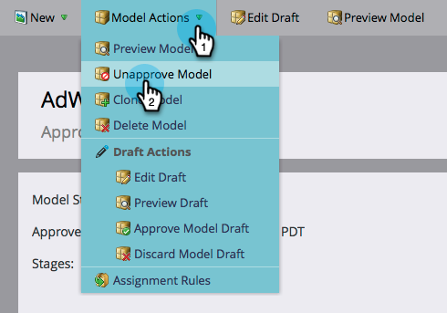

# Approvare/annullare l’approvazione di un modello di ricavi {#approve-unapprove-a-revenue-model}

Puoi avere un solo modello approvato in un dato momento.

>[!CAUTION]
>
>[Le singole tappe devono essere approvate](/help/marketo/product-docs/reporting/revenue-cycle-analytics/revenue-cycle-models/approving-stages-and-assigning-leads-to-a-revenue-model.md) e le persone aggiunte prima di approvare un intero modello.

## Approva {#approve}

1. Vai a **Analytics** area.

   

1. Selezionate un modello dall&#39;albero.

   

1. Da **Azioni modello** menu, scegli **Approva modello**.

   

1. Viene visualizzata una finestra di dialogo per confermare la scelta. Fai clic su **Approva**.

   

Il tuo modello ora è live!

## Annulla approvazione {#unapprove}

>[!CAUTION]
>
>Se disapprovi il modello, tutte le persone vengono rimosse dal modello e la loro cronologia nel modello viene eliminata.

1. Vai a **Analytics** area.

   

1. Selezionate un modello dall&#39;albero.

   

1. Fai clic sul pulsante **Azioni modello** menu e scegli **Annulla approvazione modello**.

   

1. Nella finestra di dialogo visualizzata, fai clic su **Annulla approvazione modello**.

   

Congratulazioni! Il modello non è stato approvato.

>[!CAUTION]
>
>L&#39;annullamento dell&#39;approvazione di un modello rimuove tutte le persone dal modello e rimuove la cronologia nel modello dal database.
