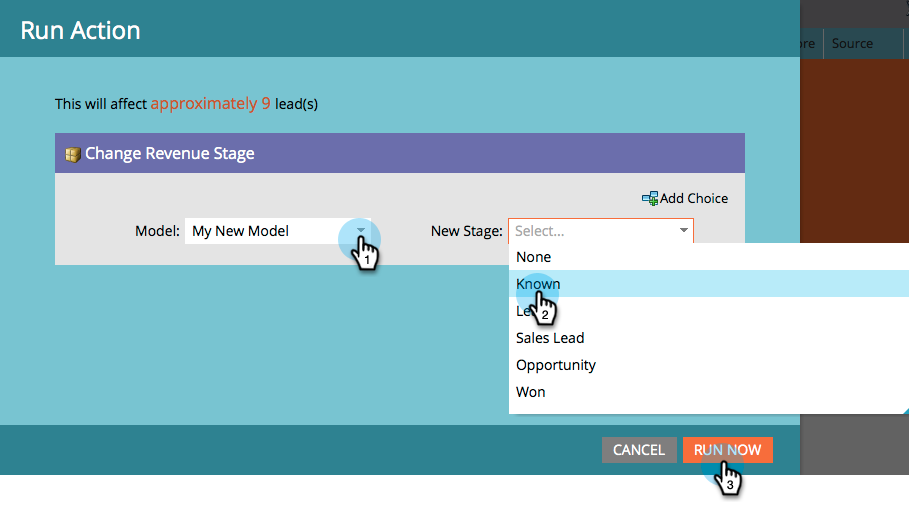

# Approvazione delle fasi e assegnazione dei lead a un modello di ricavi {#approving-stages-and-assigning-leads-to-a-revenue-model}

Ottieni il tuo **Modello dei ricavi** è possibile aggiungere lead esistenti e creare regole di assegnazione per eventuali nuovi lead.

## Approvazione delle fasi {#approving-stages}

Approviamo le fasi del modello prima di aggiungere eventuali lead.

1. Vai a **Analytics** area.

   

1. Selezionare il modello di cui si desidera approvare gli stadi.

   

1. Sotto **Azioni modello**, seleziona **Approva fasi**.

   

1. Sarai accolto con un avviso; click **Assegna lead**.

   

Eccellente! Andiamo avanti e assegniamo questi lead.

## Assegnazione di lead esistenti {#assigning-existing-leads}

[Creare un elenco avanzato](/help/marketo/product-docs/core-marketo-concepts/smart-lists-and-static-lists/creating-a-smart-list/create-a-smart-list.md) per identificare i lead per una fase del modello nel database lead.

1. Una volta [creato il tuo Smart List](/help/marketo/product-docs/core-marketo-concepts/smart-lists-and-static-lists/creating-a-smart-list/create-a-smart-list.md), fai clic su **Lead** scheda .

   

1. Fai clic su **Seleziona tutto** per selezionare i lead.

   

1. Apri **Azioni lead** a discesa e seleziona **Speciale**. Fai clic su **Cambia fase ricavi**.

   

1. Selezionare la risposta corretta **Modello** e la **Stage**. Fai clic su **Esegui ora**.

   

1. Ripetete questa operazione fino a quando tutti i lead non vengono assegnati alle varie fasi del modello.

Fantastico! Per specificare la modalità di assegnazione dei nuovi lead alle fasi, creare regole di assegnazione.

>[!NOTE]
>
>Se il modello si trova nello stato Stadi approvati, nei registri attività dei lead non verranno visualizzati eventi della fase di modifica dei ricavi. Se il modello è completamente approvato, questo passaggio di flusso verrà ignorato se si sposta un lead nello stesso stadio in cui si trova attualmente.

## Nuovi lead: Crea regole di assegnazione  {#new-leads-create-assignment-rules}

1. Fai clic su **Pagina principale di Marketo** di nuovo, seleziona **Analytics**.

   

1. Fai clic sul modello nell&#39;albero, quindi sul **Azioni modello** menu, selezione **Regole di assegnazione**.

   

1. Se le regole di assegnazione contengono più di una scelta predefinita, fai clic su **Stage**, effettua la selezione, quindi fai clic su **Aggiungi scelta**.

   

## Esempio di regola di assegnazione {#example-assignment-rule}

Crea una regola Punteggio lead per assegnare i nuovi lead con un punteggio minimo a un passaggio appropriato.

1. Sotto **Se**, seleziona **Punteggio lead**. Quindi scegli **almeno**.

   

1. Invio **40** nel campo e seleziona **Lead di vendita** come stage. Fai clic su **Salva** da completare.

   

>[!MORELIKETHIS]
>
>Per approvare il modello, consulta la nostra pagina di aiuto in **[Approvazione e annullamento dell’approvazione di un modello di ricavi](/help/marketo/product-docs/reporting/revenue-cycle-analytics/revenue-cycle-models/approve-unapprove-a-revenue-model.md)**.
