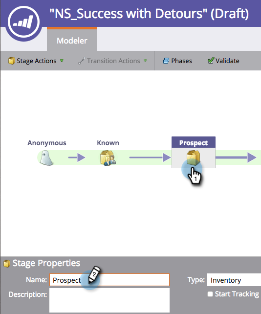

# Modificare il nome di una fase {#changing-the-name-of-a-stage}

Cambiare idea? Non è un problema. Ridenominare una fase nel modellatore del ciclo dei ricavi è facile.

1. Passa alla schermata **[!UICONTROL Analytics]**.

   

1. Seleziona un modellatore del ciclo dei ricavi da aggiornare. Fai clic su **[!UICONTROL Edit Draft]**.

   

1. Selezionare la fase da aggiornare e immettere un nuovo **[!UICONTROL Name]**.

   

1. Fai clic su **[!UICONTROL Close]**.

   

   Vedi? Facile! Ricorda di [Approvare il modello](/help/marketo/product-docs/reporting/revenue-cycle-analytics/revenue-cycle-models/approve-unapprove-a-revenue-model.md).
