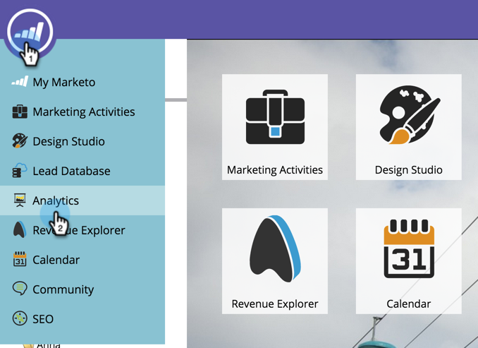
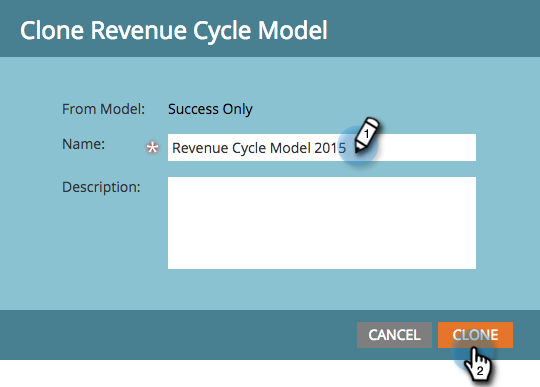

# Clonazione di un modello di ricavi di esempio di Marketo {#cloning-a-marketo-example-revenue-model}

Marketo dispone di esempi di modellatori di ricavi per aiutarti a ispirarti. Clonate questi modellatori e rendeteli personalizzati. Ecco come:

1. Passa alla schermata **[!UICONTROL Analytics]**.

   

1. Selezionare la cartella **[!UICONTROL Revenue Cycle Modeler]** e fare clic su **[!UICONTROL Marketo Examples]**.

   

1. Scegliete uno dei modellatori.

   

1. Da [!UICONTROL Model Actions], selezionare **[!UICONTROL Clone Model]**.

   

1. Immettere **[!UICONTROL Name]** e fare clic su **[!UICONTROL Clone]**.

   

   Se solo generare profitti fosse così facile!
