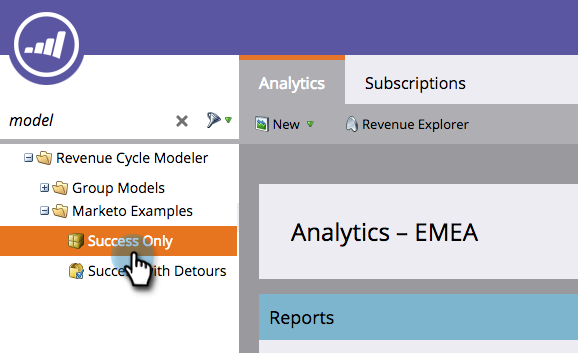
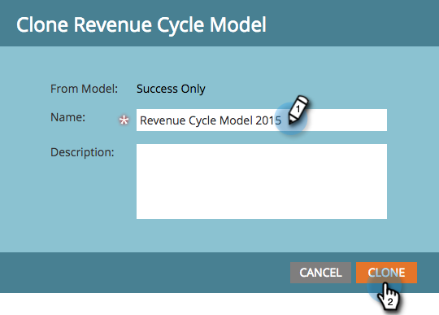

# Clonazione di un modello di ricavi di esempio di Marketo {#cloning-a-marketo-example-revenue-model}

Marketo dispone di modelli di ricavi di esempio per ispirarti. Clona questi modellatori e creali da soli. Ecco come:

1. Vai a **Analytics** area.

   

1. Seleziona **Modellatore del ciclo dei ricavi** e fai clic su **Esempi Marketo**.

   

1. Scegliere uno dei modelli.

   

1. Da Azioni modello, selezionare **Modello Clona**.

   

1. Inserisci un **Nome** e fai clic su **Clona**.

   

   Se solo generare entrate era così facile!
