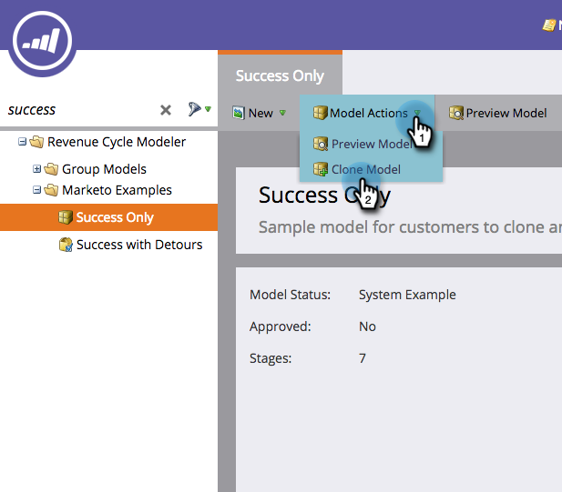

# Clonazione di un modello di ricavi di esempio di Marketo {#cloning-a-marketo-example-revenue-model}

Marketo dispone di esempi di modellatori di ricavi per aiutarti a ispirarti. Clonate questi modellatori e rendeteli personalizzati. Ecco come:

1. Vai a **Analytics** area.

   

1. Seleziona **Modellatore ciclo ricavi** e fai clic su **Esempi di Marketo**.

   

1. Scegliete uno dei modellatori.

   

1. Da Azioni modello, selezionare **Clona modello**.

   

1. Immetti un **Nome** e fai clic su **Clona**.

   

   Se solo generare profitti fosse così facile!
