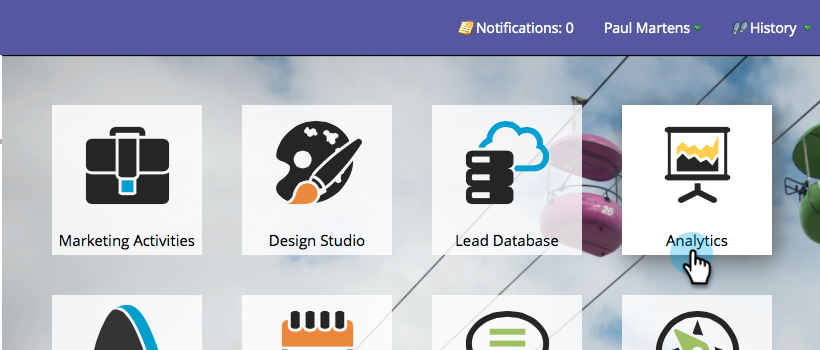
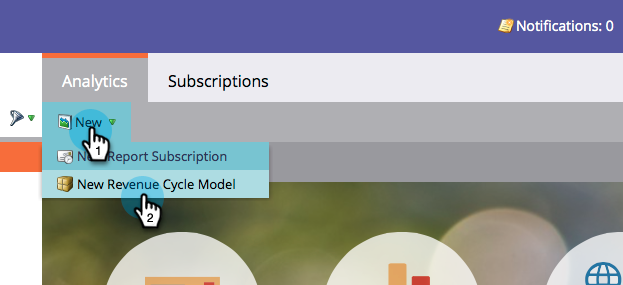
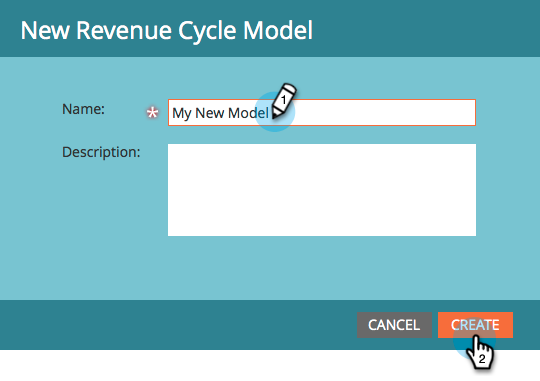
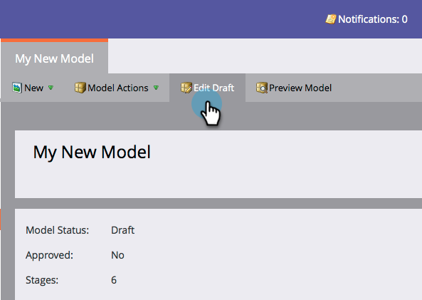
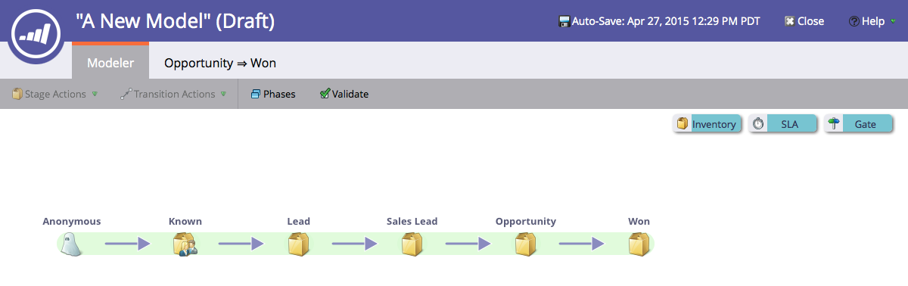

# Creare un nuovo modello di ricavi {#create-a-new-revenue-model}

1. Per creare un nuovo modello del ciclo dei ricavi, fare clic sul pulsante **[!UICONTROL Analytics]** nella schermata iniziale di [!UICONTROL My Marketo].

   

1. Nella scheda **[!UICONTROL Analytics]**, fare clic su **[!UICONTROL New]** e selezionare **[!UICONTROL New Revenue Cycle Model]**.

   

1. Viene visualizzata una finestra modale **[!UICONTROL New Revenue Cycle Model]**. Immettere un nome e fare clic su **[!UICONTROL Create]**.

   

1. Fare clic su **[!UICONTROL Edit Draft]** nella visualizzazione Home del modello.

   

1. Nella nuova finestra verrà presentato un modello con sei fasi di inventario, cinque transizioni tra queste fasi e la possibilità di aggiungere fasi di inventario, SLA e gate.

   

Sembra lucido! Sei appena entrato nel meraviglioso mondo della modellazione.

>[!MORELIKETHIS]
>
>Ulteriori informazioni sull&#39;utilizzo di [Fasi inventario modello ricavi](/help/marketo/product-docs/reporting/revenue-cycle-analytics/revenue-cycle-models/using-revenue-model-inventory-stages.md).
