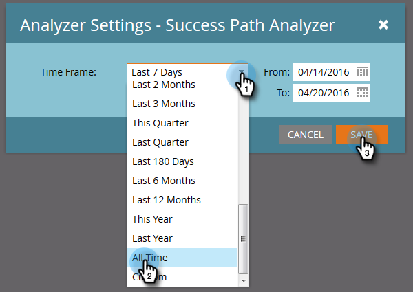
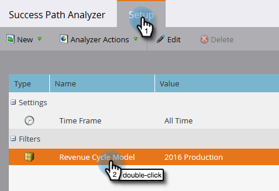

# Creare un analizzatore percorso di successo {#create-a-success-path-analyzer}

Ottieni una rappresentazione visiva di velocità e flusso attraverso il tuo [Modello del ciclo di ricavi](https://docs.marketo.com/display/docs/revenue+cycle+analytics).

>[!PREREQUISITES]
>
>[Creare un nuovo modello di ricavi](create-a-new-revenue-model.md)

1. Fate clic sulla sezione Analisi.

   

1. Fate clic sull’icona di analisi dei percorsi di successo.

   

   >[!NOTE]
   >
   >Se ricevi un avviso che segnala che non sono stati trovati dati nell&#39;intervallo di tempo specificato, fai clic su **Chiudi** per cambiare l&#39;intervallo di tempo. Se non viene richiesto, ma si desidera modificare l&#39;intervallo di tempo, andare a **Setup** e fare doppio clic******Time Frame**.

1. Se non disponete di dati o modificate l&#39;intervallo di tempo, selezionatene uno dall&#39;elenco a discesa e fate clic su Salva.

   

   >[!TIP]
   >
   >Per selezionare un intervallo specifico, selezionare i campi **Personalizzato** e utilizzare i campi **Da** e **A**.

1. Se si dispone di più modelli ciclo ricavi, selezionare quello desiderato dalla scheda Impostazione.

   

1. Scegliete il modello appropriato e fate clic su Applica.

   

1. Fare clic sulla scheda Success Path Analyzer.

   

Ora potete esplorare il movimento da ogni fase a quello successivo!

>[!TIP]
>
>Vuoi salvare il tuo rapporto? Fare clic sul menu a discesa **Azioni analizzatore** e selezionare **Salva con nome**.

>[!MORELIKETHIS]
>
>* [Utilizzo di Success Path Analyzer](using-the-success-path-analyzer.md)

>

