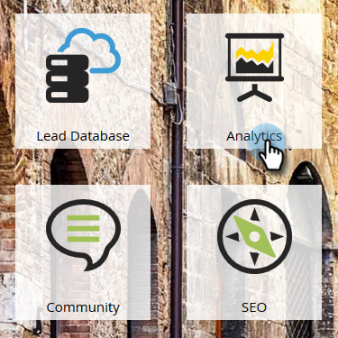
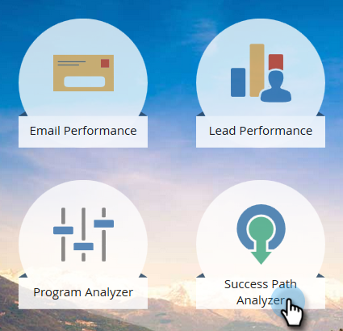
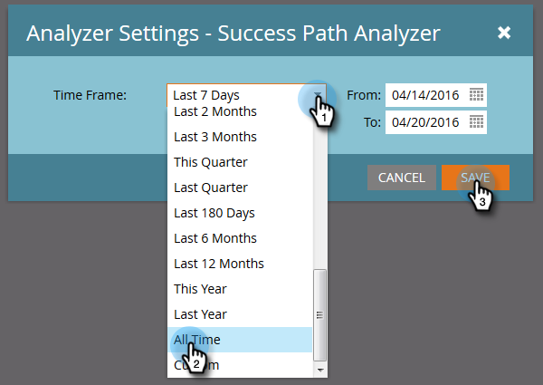
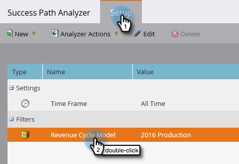
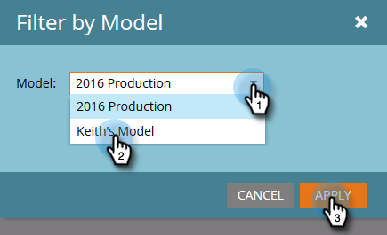
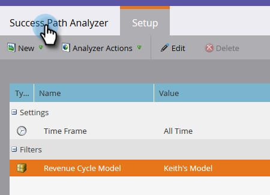

# Creare un analizzatore del percorso di successo {#create-a-success-path-analyzer}

Ottieni una rappresentazione visiva della velocità e del flusso attraverso il modello del ciclo dei ricavi.

>[!PREREQUISITES]
>
>[Crea un nuovo modello di reddito](/help/marketo/product-docs/reporting/revenue-cycle-analytics/revenue-cycle-models/create-a-new-revenue-model.md)

1. Fare clic sul riquadro **[!UICONTROL Analytics]**.

   

1. Fare clic sull&#39;icona **[!UICONTROL Success Path Analyzer]**.

   

   >[!NOTE]
   >
   >Se ricevi un avviso che informa che non sono stati trovati dati nell&#39;intervallo di tempo specificato, fai clic su **[!UICONTROL Close]** per modificare l&#39;intervallo di tempo. Se non viene richiesto, ma si desidera modificare l&#39;intervallo di tempo, passare a **[!UICONTROL Setup]** e fare doppio clic su **[!UICONTROL Time Frame]**.

1. Se non si dispone di dati o si sta modificando l&#39;intervallo di tempo, selezionarne uno dall&#39;elenco a discesa e fare clic su **[!UICONTROL Save]**.

   

   >[!TIP]
   >
   >Per selezionare un intervallo specifico, selezionare **[!UICONTROL Custom]** e utilizzare i campi **[!UICONTROL From]** e **[!UICONTROL To]**.

1. Se si dispone di più modelli del ciclo dei ricavi, selezionare quello desiderato dalla scheda **[!UICONTROL Setup]**.

   

1. Selezionare il modello appropriato e fare clic su **[!UICONTROL Apply]**.

   

1. Fai clic sulla scheda **[!UICONTROL Success Path Analyzer]**.

   

Ora puoi esplorare il movimento da ogni fase a quella successiva!

>[!TIP]
>
>Vuoi salvare il tuo rapporto? Fai clic sul menu a discesa **[!UICONTROL Analyzer Actions]** e seleziona **[!UICONTROL Save As]**.

>[!MORELIKETHIS]
>
>[Utilizzo dell&#39;analizzatore del percorso di successo](/help/marketo/product-docs/reporting/revenue-cycle-analytics/revenue-cycle-models/using-the-success-path-analyzer.md)
