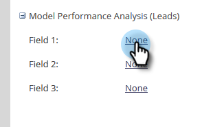

# Abilita gruppi di campi personalizzati per l&#39;analisi delle prestazioni del modello (lead) {#enable-custom-field-groups-for-model-performance-analysis-leads}

>[!PREREQUISITES]
>
>Suddividere i campi standard o personalizzati in gruppi per la generazione di rapporti tramite l&#39;Organizer campi in Marketo. Per ulteriori informazioni, consulta [Creare gruppi di campi personalizzati tramite l’Organizer campi](/help/marketo/product-docs/reporting/revenue-cycle-analytics/revenue-tools/field-organizers/create-custom-field-groups-using-the-field-organizer.md).

<table> 
 <tbody> 
  <tr> 
   <td colspan="3" rowspan="1">
<strong>In che modo l’abilitazione di un gruppo di campi personalizzato influisce su più aree di analisi in Revenue Cycle Explorer?</strong>
</td> 
  </tr> 
  <tr> 
   <td colspan="1" rowspan="1">
<strong>Cosa succede quando...?</strong>
</td> 
   <td colspan="1" rowspan="1">
<strong>Effetti sull'area Analisi prestazioni modello (lead)</strong>
</td> 
   <td colspan="1" rowspan="1">
<strong>Effetti sulle aree Analisi lead, Analisi campagna e Analisi opportunità</strong>
</td> 
  </tr> 
  <tr> 
   <td colspan="1" rowspan="1">
<strong>Cosa succede quando si abilita un gruppo di campi personalizzato associato a un campo cliente potenziale o aziendale standard?</strong>
</td> 
   <td colspan="1" rowspan="1">
Il gruppo di campi personalizzato è abilitato per la generazione di rapporti nell'area Analisi delle prestazioni del modello (lead)
</td> 
   <td colspan="1" rowspan="1">
Nessun impatto
</td> 
  </tr> 
  <tr> 
   <td colspan="1" rowspan="1">
<strong>Cosa succede quando si abilita un gruppo di campi personalizzato associato a un campo personalizzato della persona o dell’azienda?</strong>
</td> 
   <td colspan="1" rowspan="1">
Il gruppo di campi personalizzato è abilitato per la generazione di rapporti nell'area Analisi delle prestazioni del modello (lead)
</td> 
   <td colspan="1" rowspan="1">
Il campo personalizzato è abilitato per la generazione di rapporti nelle aree Analisi lead, Analisi campagna e Analisi opportunità.

<strong>NOTA:</strong> I gruppi di campi personalizzati NON sono supportati in queste aree di analisi, pertanto le associazioni dei gruppi non vengono visualizzate in Gestione ciclo di ricavi.<em>solo</em> il campo personalizzato.
</td> 
  </tr> 
 </tbody> 
</table>

Segui questi passaggi per abilitare un gruppo di campi personalizzato per il reporting nell’area Analisi delle prestazioni del modello (Lead).

1. Clic **Amministratore**.

   

1. Clic **Analisi del ciclo dei ricavi**.

   

1. Clic **Nessuno** accanto a un gruppo di campi vuoto. Se sono già stati attivati tre gruppi di campi e si desidera apportare una modifica, fare clic sul nome del gruppo di campi che si desidera modificare.

   

1. Fai clic su **Campo** e selezionare quello desiderato.

   

   >[!NOTE]
   >
   >In questo esempio viene abilitato un gruppo di campi personalizzato per un campo standard (State). Pertanto, è stata interessata solo l&#39;area Analisi prestazioni modello (lead). Se è stato abilitato un gruppo di campi personalizzato per un campo persona o società, tale gruppo viene visualizzato nella sezione Analisi delle prestazioni del modello (lead) della scheda Riepilogo sincronizzazione e il conteggio dei campi personalizzati per Analisi lead, campagna e opportunità aumenta di uno.

1. Clic **Salva**.

   
