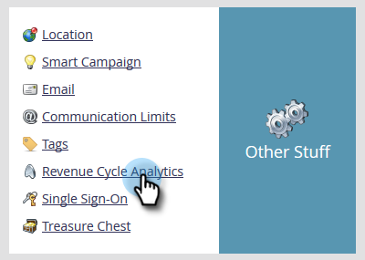

# Abilitare i gruppi di campi personalizzati per l&#39;analisi delle prestazioni del modello (Lead) {#enable-custom-field-groups-for-model-performance-analysis-leads}

>[!PREREQUISITES]
>
>Dividi in categorie i campi standard o personalizzati in gruppi per generare rapporti tramite l’Organizzatore di campi in Marketo. Per maggiori dettagli, vedi [Creare gruppi di campi personalizzati tramite l’Organizzatore di campi](/help/marketo/product-docs/reporting/revenue-cycle-analytics/revenue-tools/field-organizers/create-custom-field-groups-using-the-field-organizer.md).

<table> 
 <tbody> 
  <tr> 
   <td colspan="3" rowspan="1">
<strong>In che modo l’abilitazione di un gruppo di campi personalizzati influisce su più aree di analisi in Revenue Cycle Explorer?</strong>
</td> 
  </tr> 
  <tr> 
   <td colspan="1" rowspan="1">
<strong>Cosa succede quando..?</strong>
</td> 
   <td colspan="1" rowspan="1">
<strong>Come influisce sull’area Analisi delle prestazioni del modello (Lead)</strong>
</td> 
   <td colspan="1" rowspan="1">
<strong>Effetti sulle aree Analisi lead, Analisi campagna e Analisi opportunità</strong>
</td> 
  </tr> 
  <tr> 
   <td colspan="1" rowspan="1">
<strong>Cosa succede quando si attiva un gruppo di campi personalizzato associato a un campo lead o aziendale standard?</strong>
</td> 
   <td colspan="1" rowspan="1">
Il gruppo di campi personalizzati è abilitato per i rapporti nell’area Analisi delle prestazioni del modello (Lead)
</td> 
   <td colspan="1" rowspan="1">
Nessun impatto
</td> 
  </tr> 
  <tr> 
   <td colspan="1" rowspan="1">
<strong>Cosa succede quando si attiva un gruppo di campi personalizzato associato a un campo personalizzato persona o società?</strong>
</td> 
   <td colspan="1" rowspan="1">
Il gruppo di campi personalizzati è abilitato per i rapporti nell’area Analisi delle prestazioni del modello (Lead)
</td> 
   <td colspan="1" rowspan="1">
Il campo personalizzato è abilitato per i rapporti nelle aree Analisi lead, Analisi campagna e Analisi opportunità.

<strong>NOTA:</strong> I gruppi di campi personalizzati NON sono supportati in queste aree di analisi, pertanto le associazioni di gruppi non vengono visualizzate in Esplora ciclo ricavi—<em>only</em> il campo personalizzato.
</td> 
  </tr> 
 </tbody> 
</table>

Segui questi passaggi per abilitare un gruppo di campi personalizzati per il reporting nell’area Analisi delle prestazioni del modello (Lead).

1. Fai clic su **Amministratore**.

   

1. Fai clic su **Analisi del ciclo dei ricavi**.

   

1. Fai clic su **Nessuno** accanto a un gruppo di campi vuoto. Se sono già stati abilitati tre gruppi di campi e si desidera apportare una modifica, fare clic sul nome del gruppo di campi che si desidera modificare.

   

1. Fai clic sul pulsante **Campo** e seleziona quello desiderato.

   

   >[!NOTE]
   >
   >In questo esempio è stato abilitato un gruppo di campi personalizzati per un campo standard (Stato). Pertanto, è stata interessata solo l’area Analisi delle prestazioni del modello (Lead). Se è stato abilitato un gruppo di campi personalizzati per un campo personalizzato persona o società, il gruppo abilitato verrà visualizzato nella sezione Analisi delle prestazioni del modello (Lead) della scheda Sintetico sincronizzazione e il conteggio dei campi personalizzati per lead, campagne e analisi opportunità aumenterà di uno.

1. Fai clic su **Salva**.

   
