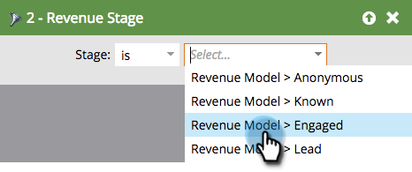

# Trova tutti i lead in un modello di ciclo delle entrate {#find-all-leads-in-a-revenue-cycle-model}

Utilizzando elenchi intelligenti, è possibile trovare facilmente tutti i membri del modello del ciclo del fatturato.

>[!PREREQUISITES]
>
>[Creare un elenco avanzato](/help/marketo/product-docs/core-marketo-concepts/smart-lists-and-static-lists/creating-a-smart-list/create-a-smart-list.md)

1. Con lo smart list selezionato, fare clic sulla scheda **Smart List**.

   

1. Individuare il filtro **Membro del modello di ricavi** e trascinarlo nell&#39;area di lavoro.

   

1. Selezionare un **modello**.

   

   In questo modo tutti i lead nel modello, indipendentemente dal palco. In genere si desidera un passaggio specifico. Utilizzate invece il filtro seguente.

1. Individuare il filtro **Revenue Stage** e trascinarlo nell&#39;area di lavoro.

   

1. Selezionare un **stage**.

   

1. Passate alla scheda **Lead** per visualizzare i risultati.

   

   >[!TIP]
   >
   >Non hai bisogno di entrambi i filtri, scegli quello che ti serve. Stiamo solo mostrando a entrambi di essere meticolosi. 

   >[!CAUTION]
   >
   >Se l’area di un lead viene modificata da una campagna esterna durante la creazione iniziale del lead, un’attività non viene registrata nel database. Questo significa che il lead non sarà incluso nel filtro per elenchi avanzati.
