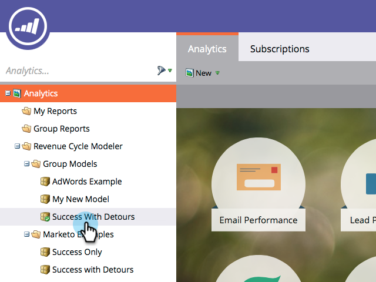

# Unione di due fasi nel modeler dei ricavi {#merging-two-stages-in-the-revenue-modeler}

Dopo aver approvato il modello, non potete eliminare le fasi durante la modifica di una bozza. Invece, puoi unire quella fase con un’altra.

1. Fare clic su **Home di Marketo** e selezionare **[!UICONTROL Analytics]**.

   

1. Fai clic sul modello approvato.

   

1. Fai clic su **[!UICONTROL Edit Draft.]**.

   

1. Fare clic con il pulsante destro del mouse sulla fase che si desidera unire e selezionare **[!UICONTROL Merge]fase** nel menu.

   

1. Fai clic sulla fase specifica nel menu a discesa.

   

1. È possibile approvare nuovamente il modello selezionando **[!UICONTROL Approve Model Draft]** nel menu **[!UICONTROL Model Actions]**.

   

>[!NOTE]
>
>Selezionare **[!UICONTROL None]** nel pull down [!UICONTROL Merge Stage] per rimuovere i lead dal modello
