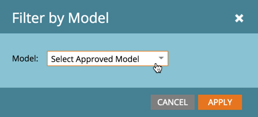
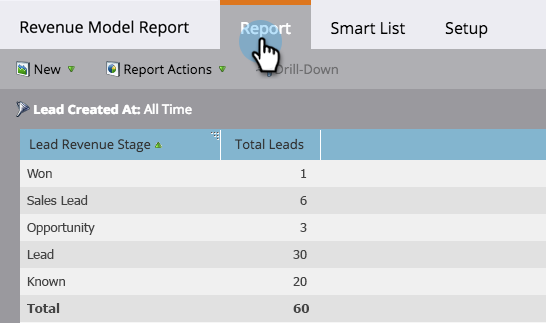

# Rapporto sul modello di ricavi {#report-on-your-revenue-model}

Per ogni modello del ciclo dei ricavi, puoi generare un rapporto sul numero di lead in ogni fase.

>[!NOTE]
>
>I lead devono essere membri del modello da includere nel rapporto.

1. Vai a **Analytics**.

   

1. Fai clic su **Fase Lead per ricavi**.

   

1. Fai clic sul pulsante **Configurazione** e quindi sotto la sezione filtro fai doppio clic su **Modello del ciclo dei ricavi**.

   

1. Seleziona la **Modello**.

   

   >[!NOTE]
   >
   >Per essere disponibile da questo menu a discesa, il modello deve essere approvato o almeno deve avere fasi approvate.

1. Fai clic sul pulsante **Rapporto** per vedere quanti lead si trovano in ogni fase del modello del ciclo di ricavi.

   

Perché questo è utile? Il modello mostra il funnel di vendita e marketing. Tieni traccia dei loro saldi nel tempo per identificare i colli di bottiglia prima che diventino un problema.
