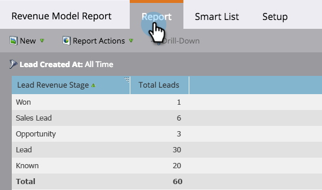

# Rapporto sul modello di ricavi {#report-on-your-revenue-model}

Per ogni modello di ciclo dei ricavi, è possibile generare un rapporto sul numero di lead presenti in ogni fase.

>[!NOTE]
>
>I lead devono essere membri del modello da includere nel rapporto.

1. Passa a **[!UICONTROL Analytics]**.

   

1. Fai clic su **[!UICONTROL Leads by Revenue Stage]**.

   

1. Fare clic sulla scheda **[!UICONTROL Setup]** e quindi fare doppio clic su **[!UICONTROL Revenue Cycle Model]** sotto la sezione del filtro.

   

1. Seleziona **[!UICONTROL Model]** approvato.

   

   >[!NOTE]
   >
   >Per essere disponibile da questo menu a discesa, il modello deve essere approvato o avere almeno fasi approvate.

1. Fare clic sulla scheda **[!UICONTROL Report]** per visualizzare il numero di lead presenti in ogni fase del modello del ciclo dei ricavi.

   

Perché questo è utile? Il modello mostra il funnel di vendita e marketing. Tenere traccia dei loro saldi nel tempo per identificare i colli di bottiglia prima che diventino un problema.
