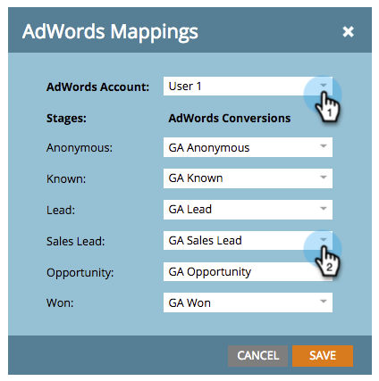

# Impostare le conversioni di Google AdWords nel modello dei ricavi con un account Manager {#set-google-adwords-conversions-in-the-revenue-model-with-a-manager-account}

Collega il tuo account Google AdWords a Marketo per caricare automaticamente i dati di conversione offline da Marketo a Google AdWords. Quindi, dall’interfaccia utente di AdWords, potrai vedere facilmente quali clic hanno generato lead qualificati, opportunità e nuovi clienti (o qualsiasi fase dei ricavi desideri monitorare) dopo di te [aggiungere colonne personalizzate](https://support.google.com/adwords/answer/3073556) in AdWords.

Se si dispone di più account Google Adwords, è possibile utilizzare un [Account Google AdWords Manager](https://www.google.com/adwords/manager-accounts/) (precedentemente noto come My Client Center) per integrarli con Marketo.

Puoi mappare le conversioni offline di AdWords in uno o più stadi in un modello Revenue. Esistono due modi:

* Azione fase
* Mappatura AdWords

>[!PREREQUISITES]
>
>[Aggiungere Google AdWords as a Launchpoint Service con un account Manager](/help/marketo/product-docs/administration/additional-integrations/add-google-adwords-as-a-launchpoint-service-with-a-manager-account.md)

## Usa azione fase {#use-stage-action}

Mappa una conversione AdWords nelle azioni stage.

1. Seleziona il passaggio da mappare a una conversione AdWords.

   

1. Sotto **Azioni fase** a discesa, seleziona **Imposta conversione AdWords**.

   

1. Imposta un **Conversione AdWords**.

   >[!NOTE]
   >
   >È possibile selezionare una conversione AdWords diversa per ogni account secondario.

   

   Suggerimento: se non hai conversioni AdWords, creane una facendo clic su **+Nuova conversione**.

   

1. Clic **Salva**.

   

1. Dopo aver completato la mappatura di tutte le conversioni AdWords nelle fasi dei ricavi, torna alla pagina di riepilogo. Seleziona **Azioni modello** e scegli **Approva fasi**.

   

## Suggerimento pro: aggiungi una nuova conversione {#pro-tip-add-a-new-conversion}

Suggerimento pro! È possibile creare una nuova conversione offline AdWords da Marketo.

>[!CAUTION]
>
>Per le nuove conversioni create da Marketo, l’impostazione &quot;ottimizzazione&quot; è abilitata. Ciò significa che le strategie di offerta di AdWords possono ottimizzare le offerte per tali conversioni. Puoi modificare questa impostazione dal tuo account AdWords.

1. Sotto **Azioni fase** a discesa, seleziona **Imposta conversione AdWords**.

   

1. Seleziona **Nuova conversione**.

   

1. Immetti un **Nome conversione**. Clic **Salva**.

   

   Eccellente! Questa nuova conversione verrà visualizzata nel tuo account AdWords.

## Usa mappatura AdWords {#use-adwords-mapping}

È possibile associare tutte le fasi del modello alla conversione AdWords in un&#39;unica posizione utilizzando le mappature AdWords.

1. Seleziona **Modifica mappature AdWords**.

   

1. Seleziona il **Account AdWords** e desiderato **Conversione AdWords** per ogni fase che si desidera monitorare.

   

1. Dopo aver mappato le fasi, fai clic su **Salva**.

   

1. Dopo aver completato la mappatura di tutte le conversioni AdWords nelle fasi dei ricavi, torna alla pagina di riepilogo. Seleziona **Azioni modello** e scegli **Approva fasi**.

   

Per visualizzare i dati di conversione offline, dovrai accedere al tuo account AdWords. Si consiglia di utilizzare i [Funzione Colonne personalizzate](https://support.google.com/adwords/answer/3073556) per creare colonne di conteggio delle conversioni per ogni conversione offline importata da Marketo.
