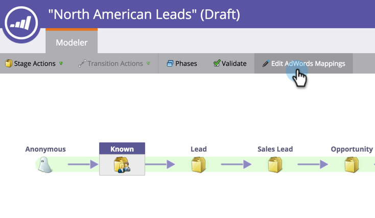

# Imposta conversioni Google AdWords nel modello Revenue con un account Manager {#set-google-adwords-conversions-in-the-revenue-model-with-a-manager-account}

Collega il tuo account Google AdWords a Marketo per caricare automaticamente i dati di conversione offline da Marketo a Google AdWords. Quindi, dall&#39;interfaccia utente di AdWords, potrai vedere facilmente quali clic hanno portato a lead qualificati, opportunità e nuovi clienti (o qualsiasi fase di fatturato desideri monitorare) dopo che hai [aggiunto colonne personalizzate](https://support.google.com/adwords/answer/3073556) in AdWords.

Se disponete di più account Google Adwords, potete utilizzare un [account Google AdWords Manager](https://www.google.com/adwords/manager-accounts/) (precedentemente denominato My Client Center) per integrarli con Marketo.

È possibile mappare le conversioni offline di AdWords su uno o più stadi in un modello Revenue. Esistono due modi:

* Azione fase
* Mappatura AdWords

>[!PREREQUISITES]
>
>[Aggiungi Google AdWords come servizio di avvio con un account manager](/help/marketo/product-docs/administration/additional-integrations/add-google-adwords-as-a-launchpoint-service-with-a-manager-account.md)

## Usa azione fase {#use-stage-action}

Mappare una conversione AdWords in Azioni fase.

1. Seleziona il passaggio da mappare a una conversione AdWords.

   

1. Nel menu a discesa **Azioni fase**, selezionare **Imposta conversione AdWords**.

   

1. Impostare una **Conversione AdWords**.

   >[!NOTE]
   >
   >Per ciascun account figlio è possibile selezionare una conversione AdWords diversa.

   

   Suggerimento: Se non hai conversioni AdWords, creane una facendo clic su **+Nuova conversione**.

   

1. Fare clic su **Salva**.

   

1. Dopo aver mappato tutte le conversioni AdWords alle fasi ricavo, torna alla pagina di riepilogo. Selezionare **Azioni modello** e scegliere **Approva fasi**.

   

## Suggerimento Pro: Aggiungere una nuova conversione {#pro-tip-add-a-new-conversion}

Suggerimento Pro! Da Marketo è possibile creare una nuova conversione offline AdWords.

>[!CAUTION]
>
>Nuove conversioni create da Marketo con l&#39;impostazione &quot;ottimizzazione&quot; abilitata. Ciò significa che le strategie di offerta AdWords possono ottimizzare le offerte per tali conversioni. Puoi modificare questa impostazione dal tuo account AdWords.

1. Nel menu a discesa **Azioni fase**, selezionare **Imposta conversione AdWords**.

   

1. Selezionare **Nuova conversione**.

   

1. Immettere un **Nome conversione**. Fare clic su **Salva**.

   

   Eccellente! Questa nuova conversione verrà visualizzata nel tuo account AdWords.

## Usa mappatura AdWords {#use-adwords-mapping}

Puoi associare tutte le fasi del modello alla conversione AdWords in un&#39;unica posizione utilizzando le mappature AdWords.

1. Selezionare **Modifica mappature AdWords**.

   

1. Selezionare l&#39;account **AdWords** desiderato e **Conversione AdWords** per ogni fase da monitorare.

   

1. Dopo aver mappato le fasi, fare clic su **Salva**.

   

1. Dopo aver mappato tutte le conversioni AdWords alle fasi ricavo, torna alla pagina di riepilogo. Selezionare **Azioni modello** e scegliere **Approva fasi**.

   

Per visualizzare i dati di conversione offline, dovrai accedere al tuo account AdWords. È consigliabile utilizzare la funzione [Colonne personalizzate](https://support.google.com/adwords/answer/3073556) per creare le colonne del conteggio di conversione per ogni conversione offline importata da Marketo.
