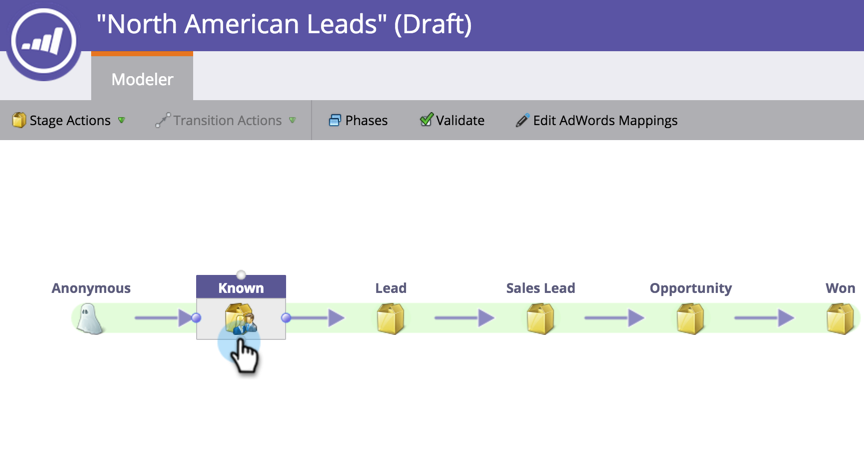
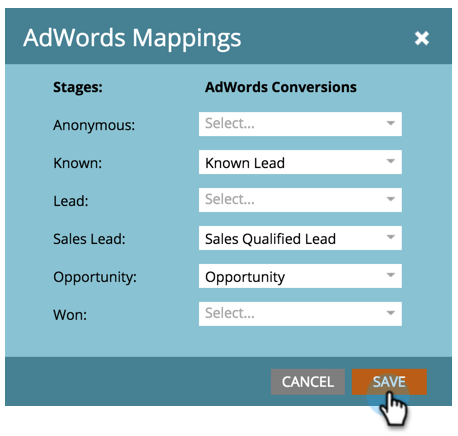

# Impostare le conversioni Google AdWords nel modello di ricavi {#set-google-adwords-conversions-in-the-revenue-model}

Collega il tuo account Google AdWords a Marketo per caricare automaticamente i dati di conversione offline da Marketo a Google AdWords. Quindi, dall’interfaccia utente di AdWords, potrai vedere facilmente quali clic hanno portato a lead qualificati, opportunità e nuovi clienti (o qualsiasi fase di ricavo desideri monitorare) dopo aver [aggiungere colonne personalizzate](https://support.google.com/adwords/answer/3073556) in AdWords.

>[!NOTE]
>
>Questa è un’integrazione push da Marketo a Google AdWords. Verranno visualizzati i dati di conversione _only_ nel portale Google AdWords, _non nell’interfaccia utente di Marketo_.

Ulteriori informazioni [Funzione di importazione della conversione offline di Google](https://support.google.com/adwords/answer/2998031?hl=en). Mappare le conversioni offline di AdWords in uno o più stadi in un modello di Ricavo. Esistono tre modi per eseguire la mappatura:

* Conversione AdWords
* Azione fase
* Mappatura di AdWords

Se si utilizza Stage Action, è possibile creare una nuova conversione offline di AdWords da Marketo.

>[!PREREQUISITES]
>
>[Aggiungere Google AdWords as a LaunchPoint Service](/help/marketo/product-docs/administration/additional-integrations/add-google-adwords-as-a-launchpoint-service.md)

## Usa conversione AdWords {#use-adwords-conversion}

1. Vai a **Analytics** area.

   

1. Seleziona un modello.

   

1. Fai clic su **Modifica bozza**.

   

1. Seleziona la fase dei ricavi da mappare a una conversione AdWords.

   

1. Seleziona la **Conversione AdWords** desideri eseguire la mappatura sul tuo stage Marketo.

   

   Bello! I dati di conversione AdWords verranno caricati sul tuo Google AdWords alla cadenza selezionata.

## Usa azione fase {#use-stage-action}

Puoi anche mappare una conversione AdWords in Azioni stage .

1. Seleziona il passaggio da mappare a una conversione AdWords.

   

1. Sotto la **Azioni stage** a discesa, seleziona **Imposta conversione AdWords**.

   

1. Seleziona un **Conversione AdWords**.

   

   **Suggerimento**: Se non hai conversioni AdWords, creane una facendo clic su **+Nuova conversione**.

   

1. Fai clic su **Salva**.

   

1. Dopo aver mappato tutte le conversioni di AdWords nelle fasi di ricavo, torna alla pagina di riepilogo. Seleziona **Azioni modello** e scegli **Approva fasi**.

   

## Consiglio Pro: Aggiungi una nuova conversione {#pro-tip-add-a-new-conversion}

Consiglio! Da Marketo è possibile creare una nuova conversione offline AdWords.

>[!CAUTION]
>
>Le nuove conversioni create da Marketo dispongono dell’impostazione &quot;ottimizzazione&quot; abilitata. Ciò significa che le strategie di offerta AdWords sono autorizzate a ottimizzare le offerte per tali conversioni. Puoi modificare questa impostazione dal tuo account AdWords.

1. Sotto la **Azioni stage** a discesa, seleziona **Imposta conversione AdWords**.

   

1. Seleziona **Nuova conversione**.

   

1. Inserisci un **Nome conversione**. Fai clic su **Salva**.

   

   Eccellente! Questa nuova conversione verrà visualizzata nel tuo account AdWords.

## Usa mappatura AdWords {#use-adwords-mapping}

Puoi associare tutte le fasi del modello alla conversione AdWords in un&#39;unica posizione utilizzando le mappature AdWords.

1. Seleziona **Modifica mappature AdWords**.

   

1. Seleziona il **Conversione AdWords** per ogni fase da monitorare.

   

1. Dopo aver mappato gli stadi, fai clic su **Salva**.

   

1. Dopo aver mappato tutte le conversioni di AdWords nelle fasi di ricavo, torna alla pagina di riepilogo. Seleziona **Azioni modello** e scegli **Approva fasi**.

   

Per visualizzare i dati di conversione offline, dovrai accedere al tuo account AdWords. Si consiglia di utilizzare le [Funzione Colonne personalizzate](https://support.google.com/adwords/answer/3073556) per creare colonne del conteggio di conversione per ogni conversione offline importata da Marketo.
