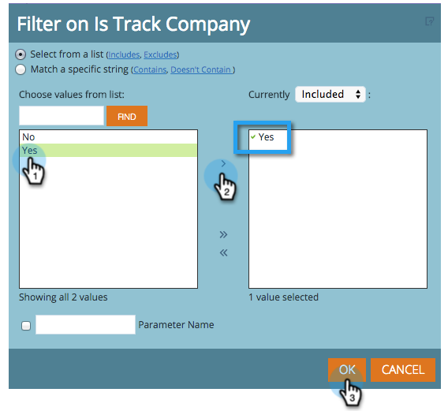

# Avviare il tracciamento per account nel Modeler ricavi {#start-tracking-by-account-in-the-revenue-modeler}

Con Revenue Stage Modeler e Revenue Explorer, puoi ottenere informazioni approfondite sulle prestazioni dei lead e degli account durante l’avanzamento del modello.

>[!NOTE]
>
>Assicurati che il modello approvato presenti fasi sul percorso di successo con **Avvia tracciamento per account** selezionato

1. Trascorso il tempo necessario per la raccolta dei dati utili, seleziona **Gestione ricavi** sotto **Home di My Marketo**.

   

1. Per creare un nuovo rapporto, fai clic su **File** e seleziona **Nuovo** allora **Report**.

   

1. Seleziona **Analisi delle prestazioni del modello (Aziende)** come area di analisi e fare clic su **OK**.

   

1. È consigliabile trascinare il **Fase**, **Mese**, e **Saldo finale** per mostrare la progressione delle aziende attraverso il modello per mese. Utilizzare i filtri per selezionare i mesi desiderati.

   

1. Al termine della configurazione del report, fai clic con il pulsante destro del mouse su **È una società di tracciamento** e seleziona **Filtro**. Questo verrà utilizzato per limitare il rapporto solo alle fasi in cui **Tracciamento per account** è selezionato.

   

1. Nella finestra di dialogo visualizzata, seleziona Sì e fai clic sulla freccia rivolta a destra al centro. Questo filtra solo le fasi con &quot;Tracciamento per account&quot; abilitato. Clic **OK** quando hai finito.

   

1. Il report ora dovrebbe mostrare solo le fasi tracciate per account. Assicurati di salvare il rapporto in modo da poterlo utilizzare in futuro. Ora puoi utilizzarlo come un’altra misura del successo delle tue attività di marketing.
