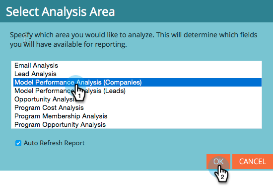

# Avvia tracciamento per account nel Modellatore ricavi {#start-tracking-by-account-in-the-revenue-modeler}

Con il Modellatore della fase delle entrate e con Esplora entrate, è possibile ottenere informazioni approfondite sulle prestazioni dei lead e degli account man mano che avanzano all&#39;interno del modello.

>[!NOTE]
>
>Verificate che il modello approvato contenga fasi nel percorso di successo con l&#39;opzione **Avvia tracciamento per account** selezionata

1. Dopo aver trascorso abbastanza tempo per raccogliere i dati utili, selezionare **Revenue Explorer** in **My Marketo Home**.

   

1. Per creare un nuovo rapporto, fare clic su **File** e selezionare **Nuovo**, quindi **Rapporto**.

   

1. Selezionare **Model Performance Analysis (Companies)** come area di analisi e fare clic su **OK**.

   

1. È consigliabile trascinare i campi **Stage**, **Mese** e **Fine di Bilanciamento** per mostrare la progressione delle aziende nel modello per mese. Utilizzate i filtri per selezionare i mesi desiderati.

   

1. Dopo aver impostato il rapporto, fare clic con il pulsante destro del mouse su **Is Track Company** e selezionare **Filter**. Verrà utilizzato per limitare il rapporto alle sole fasi in cui è selezionato **Tracciamento per account**.

   

1. Nella finestra di dialogo visualizzata, selezionate Sì e fate clic sulla freccia verso destra al centro. Questo filtrerà solo le fasi con l&#39;opzione &quot;Tracciamento per account&quot; abilitata. Fare clic su **OK** al termine.

   

1. Il rapporto ora deve mostrare solo le fasi di tracciamento per account. Accertatevi di salvare il rapporto in modo da poterlo utilizzare in futuro. Ora puoi utilizzarlo come un&#39;altra misura del successo delle tue iniziative di marketing.
