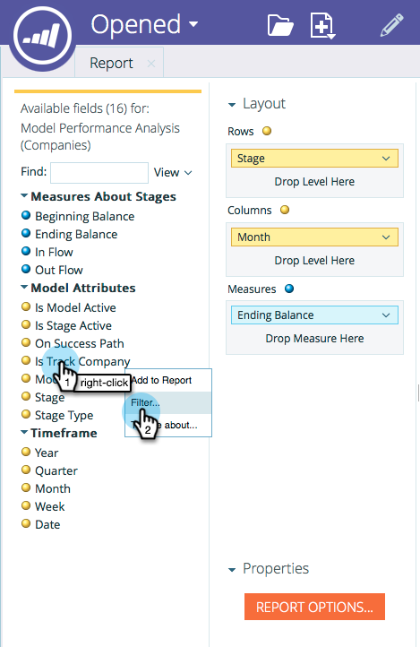

# Inizia tracciamento per account nel Modeler delle entrate {#start-tracking-by-account-in-the-revenue-modeler}

Con il Modellatore della fase delle entrate e con Esplora entrate, è possibile ottenere informazioni approfondite sulle prestazioni dei lead e degli account man mano che avanzano all&#39;interno del modello.

>[!NOTE]
>
>Verificate che il modello approvato contenga fasi nel percorso di successo con **Avvia tracciamento per account** selezionato

1. Dopo che è trascorso abbastanza tempo per raccogliere i dati utili, selezionare **Revenue Explorer** sotto il **Marketo Home**.

   

1. Per creare un nuovo rapporto, fai clic su **File** e seleziona **Nuovo** quindi **Rapporto**.

   

1. Selezionate **Model Performance Analysis (Companies)** come area di analisi e fate clic su **OK**.

   

1. È consigliabile trascinare i campi **Stage**, **Mese** e **Saldo** finale per visualizzare la progressione mensile delle società nel modello. Utilizzate i filtri per selezionare i mesi desiderati.

   

1. Dopo aver configurato il rapporto, fai clic con il pulsante destro del mouse su **Is Track Company** e seleziona **Filtro**. Utilizzeremo questa opzione per limitare il rapporto alle sole fasi in cui è selezionato **Tracciamento per account** .

   

1. Nella finestra di dialogo visualizzata, selezionate Sì e fate clic sulla freccia verso destra al centro. Questo filtrerà solo le fasi con l&#39;opzione &quot;Tracciamento per account&quot; abilitata. Al termine, fate clic su **OK** .

   

1. Il rapporto ora deve mostrare solo le fasi di tracciamento per account. Accertatevi di salvare il rapporto in modo da poterlo utilizzare in futuro. Ora puoi utilizzarlo come un&#39;altra misura del successo delle tue iniziative di marketing.

