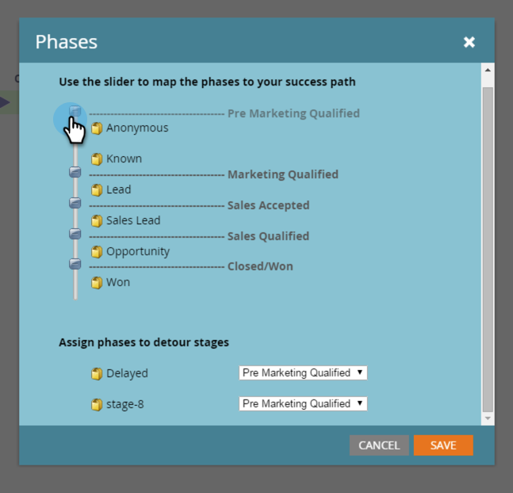

# Informazioni sulle fasi del modello di ricavi {#understanding-revenue-model-phases}

Le fasi sono un modo per raggruppare una serie di fasi. A volte più fasi in un modello riflettono una fase di un funnel.

## Definire le fasi del modello {#define-the-phases-of-the-model}

1. Fai clic su **[!UICONTROL Phases]**.

   

1. Fai clic sul pulsante blu per trascinare le fasi verso l’alto o il basso attraverso le fasi.

   
