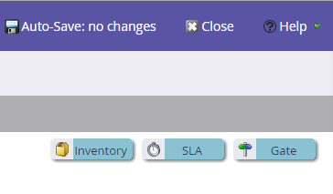

# Informazioni sui modelli di ricavo {#understanding-revenue-models}

I modelli del ciclo dei ricavi portano il marketing al livello successivo. Modellano tutte le fasi dell’intero funnel di fatturato, dalla prima interazione con un lead fino a quando il lead non è un cliente acquisito.

## Modello mentale (come pensare a questa cosa) {#mental-model-how-to-think-about-this-thing}

Il Modeler è come una serie di secchi con dentro dell&#39;acqua. Ci sono dei fori nella parte inferiore dei secchi.

Il modellatore misurerà la quantità di acqua (derivazioni) che entra nel secchio ogni giorno e la quantità di acqua che esce dai fori. (possono esistere più fori)

Il modellatore misura tutti i lead nel bucket in un dato momento. Questo si chiama bilanciamento dello stadio.

>[!TIP]
>
>Per coloro che sono più orientati finanziariamente, si possono pensare alle fasi come conti con il denaro che fluisce dentro e fuori con il saldo alla fine di ogni giorno.

I modelli sono generalmente per i clienti che hanno dimestichezza con campagne e programmi intelligenti e desiderano portare le loro analisi al livello successivo.

## Iniziare con un nuovo modello {#starting-with-a-new-model}

Per impostazione predefinita, un nuovo modello inizia con sei stadi di ricavo. Questo modello in realtà è perfetto da solo, ma può essere profondamente personalizzato.

Notate che sono tutti su sfondo verde. Questa funzione è denominata **Percorso di successo**. Ulteriori informazioni sul percorso di successo [qui](/help/marketo/product-docs/reporting/revenue-cycle-analytics/revenue-cycle-models/understanding-revenue-model-success-path.md).

**Fasi** sono le tappe di una progressione di lead verso i loro obiettivi.

**Transizioni** vengono visualizzate come frecce e controllano il modo in cui le lead si spostano tra gli stadi.

>[!NOTE]
>
>La fase anonima è speciale. Sono tutte le persone che visitano il tuo sito web, ma non sei sicuro di chi siano. Non puoi modificare questa fase.

## Personalizzazione {#customization}

Ogni azienda è diversa. Puoi aggiungere elementi al modello trascinandoli dalla parte in alto a destra.

## Fase inventario {#inventory-stage}

Questa sembra una scatola ed è la più semplice delle fasi. Analytics terrà traccia di afflusso, deflusso e saldo di questa fase.

## Fase SLA {#sla-stage}

Questo è l’abbreviazione di **Accordo sui livelli di servizio** fase. L’obiettivo è quello di applicare un limite di tempo in alcune fasi.

>[!NOTE]
>
>**Esempio**
>
>Quando un lead compila un modulo &quot;Contact Me&quot; (Contattami) e invii un avviso a un rappresentante di vendita, potresti desiderare uno SLA di 72 ore. Sarai in grado di tenere traccia delle infrazioni e rimproverare la rappresentante per aver lasciato un buon lead incommunicado.

## Gate Stage {#gate-stage}

Una fase Gate è destinata alle situazioni in cui si desidera filtrare i lead in una di più scelte. Si tratta di un’opzione avanzata. I principianti dovrebbero evitare i cancelli.

>[!NOTE]
>
>**Esempio**
>
>Un gate può essere utilizzato per i lead che fanno parte di un **elenco di account denominati** per separare questo processo dal normale.

## Transizioni {#transitions}

Chiarisci esattamente come un lead si sposta da una fase all’altra utilizzando campagne intelligenti e assicurati che i lead non rimangano bloccati in nessuna fase. Assicurati di utilizzare i filtri di attivazione per le transizioni a (un modo per valutare).

>[!NOTE]
>
>**Esempio**
>
>Una transizione può essere definita da un lead che compila un modulo.

Aggiunta di una fase del percorso di successo felice

Lost è un buon esempio da aggiungere, ma notate che non si trova sul percorso verde. Questo perché non è un &quot;successo&quot;.

>[!MORELIKETHIS]
>
>* [Crea un nuovo modello di ricavi](/help/marketo/product-docs/reporting/revenue-cycle-analytics/revenue-cycle-models/create-a-new-revenue-model.md)
>
>* [Utilizzo delle fasi di magazzino del modello di ricavo](/help/marketo/product-docs/reporting/revenue-cycle-analytics/revenue-cycle-models/using-revenue-model-inventory-stages.md)
>
>* [Utilizzo degli stadi del gate del modello di ricavo](/help/marketo/product-docs/reporting/revenue-cycle-analytics/revenue-cycle-models/using-revenue-model-gate-stages.md)
>
>* [Utilizzo degli stadi SLA del modello ricavi](/help/marketo/product-docs/reporting/revenue-cycle-analytics/revenue-cycle-models/using-revenue-model-sla-stages.md)
>
>* [Rapporto sul modello di reddito](/help/marketo/product-docs/reporting/revenue-cycle-analytics/revenue-cycle-models/report-on-your-revenue-model.md)
>
>* [Approvare/Annullare l&#39;approvazione di un modello di ricavi](/help/marketo/product-docs/reporting/revenue-cycle-analytics/revenue-cycle-models/approve-unapprove-a-revenue-model.md)
