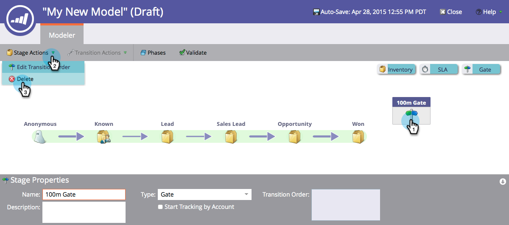

# Utilizzo degli stadi del gate del modello di ricavo {#using-revenue-model-gate-stages}

Una fase del gate funge da controllo di qualificazione.

>[!TIP]
>
>È consigliabile creare un modello di esercitazione in un programma grafico o di presentazione e confermarlo con i colleghi.

## Aggiungi Un Gate Stage {#add-a-gate-stage}

1. Vai a **Analytics** area.

   

1. Seleziona un modello esistente oppure [creane uno nuovo](/help/marketo/product-docs/reporting/revenue-cycle-analytics/revenue-cycle-models/create-a-new-revenue-model.md).

   

1. Clic **Modifica bozza**.

   

1. Fai clic su **Cancello** , quindi trascinare e rilasciare in un punto qualsiasi dell&#39;area di lavoro.

   

1. Modifica il **Nome** e seleziona un **Tipo**.

   >[!NOTE]
   >
   >Seleziona [Avvia tracciamento per account](/help/marketo/product-docs/reporting/revenue-cycle-analytics/revenue-cycle-models/start-tracking-by-account-in-the-revenue-modeler.md) in questo momento per ottenere informazioni sulle prestazioni dei tuoi account mentre progrediscono attraverso il tuo modello.

   

>[!NOTE]
>
>Lo stadio del cancello divide i lead in base ai criteri inseriti nelle regole di transizione; **non contiene i lead**. È necessaria una transizione predefinita in modo che i lead che non sono stati scelti dalle altre transizioni finiscano per passare attraverso il valore predefinito.

## Modificare una fase del gate {#edit-a-gate-stage}

Modificate Nome (Name), Descrizione (Description) e Tipo (Type) dello stadio del cancello. Puoi anche scegliere di [Avvia tracciamento per account](/help/marketo/product-docs/reporting/revenue-cycle-analytics/revenue-cycle-models/start-tracking-by-account-in-the-revenue-modeler.md).

1. Fai clic su un **Cancello** icona stage.

   

1. Fai clic su all’interno del **Nome** e **Descrizione** per modificarne il contenuto.

   

1. Seleziona la **Tipo** da modificare.

   

## Eliminare Una Fase Del Gate {#delete-a-gate-stage}

1. È possibile eliminare una fase del gate facendo clic con il pulsante destro del mouse sull&#39;icona della fase del gate e selezionando **Elimina**.

   

1. È inoltre possibile eliminare una fase Gate facendo clic su di essa, quindi nella **Azioni fase** a discesa, selezione **Elimina**.

   

1. Entrambi i metodi di eliminazione richiedono di confermare la scelta. Clic **Elimina**.

   

Congratulazioni! Ora capite il meraviglioso mondo dei Gate Stages.

>[!MORELIKETHIS]
>
>* [Utilizzo delle fasi di magazzino del modello di ricavo](/help/marketo/product-docs/reporting/revenue-cycle-analytics/revenue-cycle-models/using-revenue-model-inventory-stages.md)
>* [Utilizzo degli stadi SLA del modello ricavi](/help/marketo/product-docs/reporting/revenue-cycle-analytics/revenue-cycle-models/using-revenue-model-sla-stages.md)
>* [Crea un nuovo modello di ricavi](/help/marketo/product-docs/reporting/revenue-cycle-analytics/revenue-cycle-models/create-a-new-revenue-model.md).
