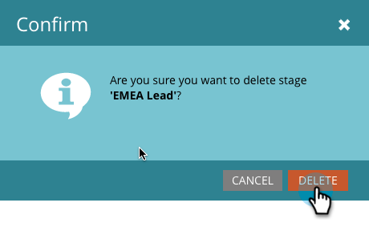

# Utilizzo delle fasi di inventario del modello di ricavi {#using-revenue-model-inventory-stages}

Tutti i lead e i conti noti risiedono inizialmente nella fase Inventario. Questo pool di potenziali clienti è il luogo in cui i lead vengono nutriti fino a quando non sono pronti per le vendite. Non esiste un limite di tempo in una fase di inventario.

>[!TIP]
>
>È un&#39;ottima idea creare un modello di esercitazione in un programma di grafica o presentazione e confermarlo prima con i colleghi.

## Aggiungi una fase di inventario {#add-an-inventory-stage}

1. Per aggiungere una nuova fase Inventario modello di ciclo dei ricavi, fai clic su **Analytics** nel **My Marketo** schermata iniziale.

   

1. In **Analytics** selezionare il modello esistente oppure [crearne una nuova](/help/marketo/product-docs/reporting/revenue-cycle-analytics/revenue-cycle-models/create-a-new-revenue-model.md).

   

1. Fai clic su **Modifica bozza**.

   

1. Per aggiungere una nuova fase di inventario, fai clic sul pulsante **Inventario** quindi trascinare e rilasciare in qualsiasi punto dell’area di lavoro.

   

1. È possibile modificare il Nome, aggiungere una Descrizione e regolare il Tipo dopo l’aggiunta di un’area di visualizzazione. Puoi anche selezionare **[Avvia tracciamento per account](/help/marketo/product-docs/reporting/revenue-cycle-analytics/revenue-cycle-models/start-tracking-by-account-in-the-revenue-modeler.md)** in questo momento.

   

## Modificare una fase di inventario {#edit-an-inventory-stage}

Quando selezioni un’icona Inventario puoi modificare la **Nome**, aggiungi un **Descrizione** o regolare **Tipo**. Puoi anche selezionare [Avvia tracciamento per account](/help/marketo/product-docs/reporting/revenue-cycle-analytics/revenue-cycle-models/start-tracking-by-account-in-the-revenue-modeler.md).

1. Fai clic su un’icona Inventario .

   

1. Fai clic in **Nome** e **Descrizione** per modificarne il contenuto.

   

1. Seleziona la **Tipo** a discesa per modificare.

   

## Eliminare Una Fase Di Inventario {#delete-an-inventory-stage}

1. È possibile eliminare una fase di inventario facendo clic con il pulsante destro del mouse o selezionando l&#39;icona di una fase di inventario.

   

1. È inoltre possibile eliminare una fase facendo clic su di essa, quindi nella **Azioni stage** a discesa, seleziona **Elimina**.

   

1. Entrambi i metodi di eliminazione richiedono di confermare la scelta. Fai clic su **Elimina**.

   

Congratulazioni! Ora capite il meraviglioso mondo delle fasi di inventario.
