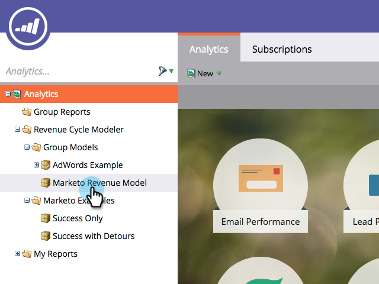

# Utilizzo delle fasi di inventario del modello di ricavi {#using-revenue-model-inventory-stages}

Tutti i lead e i conti noti risiedono inizialmente nella fase Inventory. Questo pool di potenziali clienti è il luogo in cui i lead vengono nutriti fino alla fase di vendita. Non esiste alcun limite di tempo per una fase di inventario.

>[!TIP]
>
>È una grande idea creare un modello di pratica in un programma grafico o di presentazione e confermarlo prima con i colleghi.

## Aggiungere un&#39;area di magazzino {#add-an-inventory-stage}

1. Per aggiungere una nuova fase Inventario modello ciclo ricavi, fare clic sul pulsante **Analytics** nella schermata principale **My Marketo**.

   

1. Nella sezione **Analytics**, selezionare il modello esistente oppure [crearne uno nuovo](/help/marketo/product-docs/reporting/revenue-cycle-analytics/revenue-cycle-models/create-a-new-revenue-model.md).

   

1. Fare clic su **Modifica bozza**.

   

1. Per aggiungere una nuova fase di inventario, fare clic sul pulsante **Inventory**, quindi trascinare e rilasciare in qualsiasi punto del quadro.

   

1. Potete modificare il Nome, aggiungere una Descrizione e regolare il Tipo dopo l’aggiunta di un’area di visualizzazione. Al momento è inoltre possibile selezionare **[Avvia tracciamento per account](/help/marketo/product-docs/reporting/revenue-cycle-analytics/revenue-cycle-models/start-tracking-by-account-in-the-revenue-modeler.md)**.

   

## Modifica di un&#39;area di magazzino {#edit-an-inventory-stage}

Quando si seleziona un&#39;icona Inventory è possibile modificare il **Nome**, aggiungere una **Descrizione** o regolare il **Tipo**. È inoltre possibile selezionare [Avvia tracciamento per account](/help/marketo/product-docs/reporting/revenue-cycle-analytics/revenue-cycle-models/start-tracking-by-account-in-the-revenue-modeler.md).

1. Fate clic sull&#39;icona Inventory (Inventario).

   

1. Fare clic all&#39;interno dei campi **Name** e **Description** per modificarne il contenuto.

   

1. Selezionare il pulldown **Type** da modificare.

   

## Eliminazione di un&#39;area di magazzino {#delete-an-inventory-stage}

1. È possibile eliminare una fase di magazzino facendo clic con il pulsante destro del mouse o selezionando l&#39;icona di una fase di inventario.

   

1. È inoltre possibile eliminare un&#39;area di visualizzazione facendo clic su di essa, quindi nel menu a discesa **Azioni fase** selezionare **Elimina**.

   

1. Entrambi i metodi di eliminazione richiedono di confermare la scelta. Fare clic su **Elimina**.

   

Congratulazioni! Ora puoi capire il meraviglioso mondo delle fasi di inventario.
