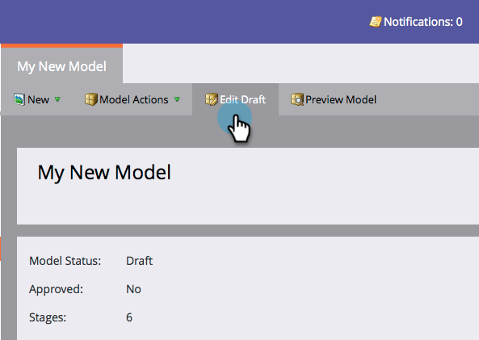
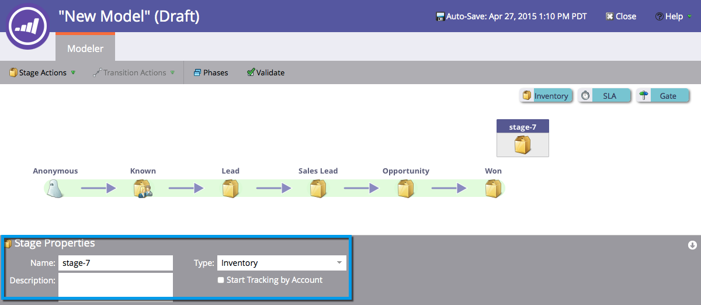

# Utilizzo delle fasi di magazzino del modello di ricavo {#using-revenue-model-inventory-stages}

Tutti i lead e gli account noti risiedono inizialmente nella fase di inventario. In questo pool di potenziali clienti i lead vengono coltivati fino a quando non sono pronti per la vendita. Non esiste alcun limite di tempo per una fase di inventario.

>[!TIP]
>
>È consigliabile creare un modello di esercitazione in un programma grafico o di presentazione e confermarlo con i colleghi.

## Aggiungi Una Fase Di Inventario {#add-an-inventory-stage}

1. Per aggiungere una nuova fase dell&#39;inventario del modello del ciclo dei ricavi, fare clic sul pulsante **[!UICONTROL Analytics]** nella schermata iniziale di **[!UICONTROL My Marketo]**.

   

1. Nella sezione **[!UICONTROL Analytics]**, seleziona il modello esistente o [creane uno nuovo](/help/marketo/product-docs/reporting/revenue-cycle-analytics/revenue-cycle-models/create-a-new-revenue-model.md).

   

1. Fai clic su **[!UICONTROL Edit Draft]**.

   

1. Per aggiungere una nuova fase di inventario, fare clic sul pulsante **[!UICONTROL Inventory]**, quindi trascinare e rilasciare in qualsiasi punto all&#39;interno dell&#39;area di lavoro.

   

1. È possibile modificare **[!UICONTROL Name]**, aggiungere **[!UICONTROL Description]** e regolare **[!UICONTROL Type]** dopo aver aggiunto una fase. Al momento puoi anche selezionare **[[!UICONTROL Start Tracking by Account]](/help/marketo/product-docs/reporting/revenue-cycle-analytics/revenue-cycle-models/start-tracking-by-account-in-the-revenue-modeler.md)**.

   

## Modificare una fase di inventario {#edit-an-inventory-stage}

Quando selezioni un&#39;icona Inventario puoi modificare **[!UICONTROL Name]**, aggiungere un **[!UICONTROL Description]** o regolare **[!UICONTROL Type]**. È inoltre possibile selezionare [[!UICONTROL Start Tracking by Account]](/help/marketo/product-docs/reporting/revenue-cycle-analytics/revenue-cycle-models/start-tracking-by-account-in-the-revenue-modeler.md).

1. Fare clic su un&#39;icona di **[!UICONTROL Inventory]**.

   

1. Fare clic nei campi **[!UICONTROL Name]** e **[!UICONTROL Description]** per modificarne il contenuto.

   

1. Selezionare il menu a discesa **[!UICONTROL Type]** da modificare.

   

## Eliminare Una Fase Di Magazzino {#delete-an-inventory-stage}

1. È possibile eliminare una fase di magazzino facendo clic con il pulsante destro del mouse o facendo clic sull&#39;icona di una fase di magazzino.

   

1. È inoltre possibile eliminare una fase facendo clic su di essa, quindi nel menu a discesa **[!UICONTROL Stage Actions]** selezionare **[!UICONTROL Delete]**.

   

1. Entrambi i metodi di eliminazione richiedono di confermare la scelta. Fai clic su **[!UICONTROL Delete]**.

   

Congratulazioni! Ora capisci il meraviglioso mondo delle Fasi di Inventario.
