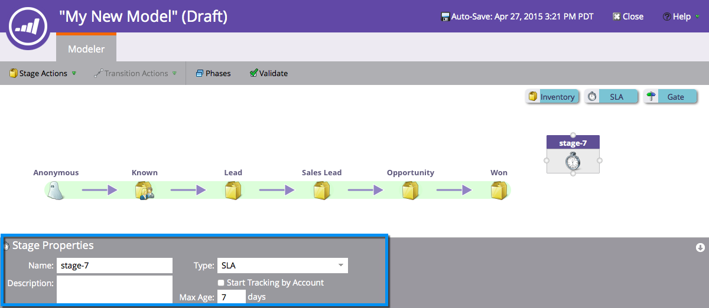
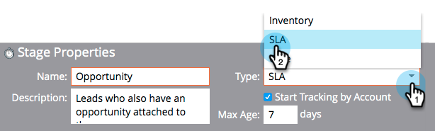

# Utilizzo degli stadi SLA del modello ricavi {#using-revenue-model-sla-stages}

SLA sta per &quot;service level agreement&quot; (accordo sul livello di servizio). Questi stadi vengono utilizzati quando esiste un tempo massimo definito in cui un lead deve essere valutato o elaborato prima di procedere o uscire dal processo.

>[!TIP]
>
>È consigliabile creare un modello di esercitazione in un programma grafico o di presentazione e confermarlo con i colleghi.

## Aggiungi una fase SLA {#add-an-sla-stage}

1. Per aggiungere una nuova fase del contratto di servizio del modello del ciclo dei ricavi, fare clic sul pulsante **Analytics** nella schermata iniziale di My Marketo.

   

1. Nella sezione Analytics, seleziona il modello esistente, oppure [creane uno nuovo](/help/marketo/product-docs/reporting/revenue-cycle-analytics/revenue-cycle-models/create-a-new-revenue-model.md).

   

1. Clic **Modifica bozza**.

   

1. Per aggiungere una nuova fase del contratto di servizio, fare clic su **SLA** , quindi trascinarlo e rilasciarlo in qualsiasi punto all’interno dell’area di lavoro.

   

1. È possibile modificare il **Nome**, aggiungi un **Descrizione** e regola **Tipo** dopo l&#39;aggiunta di una fase. Puoi anche selezionare **[Avvia tracciamento per account](/help/marketo/product-docs/reporting/revenue-cycle-analytics/revenue-cycle-models/start-tracking-by-account-in-the-revenue-modeler.md)** in questo momento.

   

## Modificare una fase del contratto di servizio {#edit-an-sla-stage}

Quando si seleziona un&#39;icona di fase SLA è possibile modificare il Nome, aggiungere una Descrizione e regolare il Tipo. Puoi anche selezionare [Avvia tracciamento per account](/help/marketo/product-docs/reporting/revenue-cycle-analytics/revenue-cycle-models/start-tracking-by-account-in-the-revenue-modeler.md).

1. Fare clic sull&#39;icona di una fase SLA.

   

1. Fai clic su all’interno del **Nome** e **Descrizione** per modificarne il contenuto.

   

1. Seleziona la **Tipo** a discesa per la modifica.

   

## Eliminare Una Fase SLA {#delete-an-sla-stage}

1. È possibile eliminare una fase SLA facendo clic con il pulsante destro del mouse o facendo clic tenendo premuto il tasto Ctrl sull&#39;icona di una fase SLA.

   

1. È inoltre possibile eliminare una fase facendo clic su di essa, quindi nel menu a discesa Azioni fase selezionare Elimina.

   
