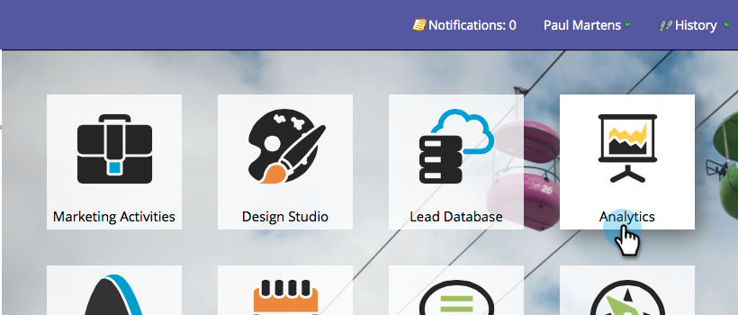

# Utilizzo degli stadi di SLA del modello di ricavo {#using-revenue-model-sla-stages}

SLA sta per service level agreement. Questi stadi vengono utilizzati quando esiste un tempo massimo definito in cui un lead deve essere valutato o elaborato prima di procedere o uscire dal processo.

>[!TIP]
>
>È consigliabile creare un modello di esercitazione in un programma grafico o di presentazione e confermarlo con i colleghi.

## Aggiungere Una Fase Di SLA {#add-an-sla-stage}

1. Per aggiungere una nuova fase di SLA Revenue Cycle Model, fare clic sul pulsante **[!UICONTROL Analytics]** nella schermata iniziale di [!UICONTROL My Marketo].

   

1. Nella sezione [!UICONTROL Analytics], seleziona il modello esistente o [creane uno nuovo](/help/marketo/product-docs/reporting/revenue-cycle-analytics/revenue-cycle-models/create-a-new-revenue-model.md).

   

1. Fai clic su **[!UICONTROL Edit Draft]**.

   

1. Per aggiungere una nuova fase di SLA, fare clic sul pulsante **[!UICONTROL SLA]**, quindi trascinare e rilasciare in qualsiasi punto all&#39;interno dell&#39;area di lavoro.

   

1. È possibile modificare **[!UICONTROL Name]**, aggiungere **[!UICONTROL Description]** e regolare **[!UICONTROL Type]** dopo aver aggiunto una fase. Al momento puoi anche selezionare **[[!UICONTROL Start Tracking by Account]](/help/marketo/product-docs/reporting/revenue-cycle-analytics/revenue-cycle-models/start-tracking-by-account-in-the-revenue-modeler.md)**.

   

## Modificare una fase di SLA {#edit-an-sla-stage}

Quando selezioni un&#39;icona di SLA stage puoi modificare **[!UICONTROL Name]**, aggiungere un **[!UICONTROL Description]** e regolare **[!UICONTROL Type]**. È inoltre possibile selezionare [[!UICONTROL Start Tracking by Account]](/help/marketo/product-docs/reporting/revenue-cycle-analytics/revenue-cycle-models/start-tracking-by-account-in-the-revenue-modeler.md).

1. Fare clic su un&#39;icona di SLA stage.

   

1. Fare clic nei campi **[!UICONTROL Name]** e **[!UICONTROL Description]** per modificarne il contenuto.

   

1. Selezionare il menu a discesa **[!UICONTROL Type]** da modificare.

   

## Eliminare Una Fase Di SLA {#delete-an-sla-stage}

1. È possibile eliminare una fase di SLA facendo clic con il pulsante destro del mouse o facendo clic tenendo premuto il tasto Ctrl sull&#39;icona di una fase di SLA.

   

1. È inoltre possibile eliminare una fase facendo clic su di essa, quindi nel menu a discesa **[!UICONTROL Stage Actions]** selezionare **[!UICONTROL Delete]**.

   
