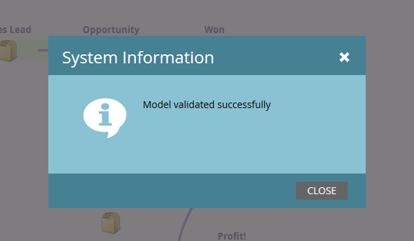

# Utilizzo delle transizioni del modello di ricavo {#using-revenue-model-transitions}

>[!PREREQUISITES]
>
>[Crea un nuovo modello di ricavi](/help/marketo/product-docs/reporting/revenue-cycle-analytics/revenue-cycle-models/create-a-new-revenue-model.md)

Quando crei il modello e selezioni e organizzi le fasi di inventario, è il momento di impostare le transizioni.

1. Fai clic con il pulsante destro del mouse (puoi anche fare doppio clic) su una delle frecce per iniziare e seleziona **Modifica transizione**.

   

   >[!NOTE]
   >
   >Impossibile modificare le regole di transizione &quot;Anonimo ⇒ noto&quot;.

1. Viene visualizzata una nuova scheda per la transizione selezionata.

   

1. Le transizioni controllano il modo in cui i lead si spostano tra gli stadi. Trascina il trigger (o filtro) desiderato da destra e rilascialo ovunque nell’area di lavoro. In questo esempio, selezioneremo il trigger Modulo di compilazione.

   >[!TIP]
   >
   >Poiché il modellatore dei ricavi ti sta configurando per il reporting, si consiglia di includere sempre i trigger nelle transizioni. In questo modo i rapporti rifletteranno la vera velocità del flusso del modello/stadio. È possibile aggiungere filtri con i trigger per vincoli aggiuntivi.

   

1. Scegli i parametri per il trigger/filtro selezionato.

   

1. Per tornare al modello, fai clic su **Modeler**.

   

1. Nella parte inferiore della schermata vengono visualizzate le regole di transizione.

   

1. Dopo aver configurato le regole per tutte le transizioni, fai clic su **Convalida** da verificare.

   

1. Se eseguito correttamente, verrà visualizzato il seguente messaggio.

   

Ben fatto! Le transizioni del modello sono state modificate.

>[!MORELIKETHIS]
>
>[Approvare/Annullare l&#39;approvazione di un modello di ricavi](/help/marketo/product-docs/reporting/revenue-cycle-analytics/revenue-cycle-models/approve-unapprove-a-revenue-model.md)
